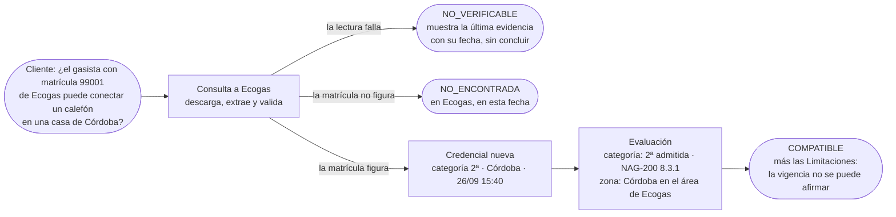

# MatriculAR

**Trabajo final · Tecnicatura Universitaria en Programación (UTN)**

Plataforma que responde, **con evidencia fechada y citable**, si la matrícula de un gasista es compatible con un trabajo concreto: qué sabemos, de qué fuente, cuándo lo consultamos y qué no podemos afirmar. Sobre ese núcleo se monta la búsqueda y la contratación de profesionales.

> **Estado del proyecto:** etapa 3 de la hoja de ruta, **Arquitectura y Módulos** (segunda entrega, 27/09/2026). Es una etapa de **análisis y diseño: todavía no hay código del sistema.** La implementación empieza cuando el tutor apruebe este diseño.
>
> 👉 **Para revisar la entrega, empezar por el [informe de avance](docs/informe-avance-entrega-2.md)**, que incluye la respuesta punto por punto a la devolución v2.

---

## Tabla de contenidos

- [Documentación](#documentación)
- [El problema](#el-problema)
- [Qué es MatriculAR](#qué-es-matricular)
- [Principios rectores](#principios-rectores)
- [Cómo funciona](#cómo-funciona)
- [Alcance](#alcance)
- [Arquitectura y tecnologías](#arquitectura-y-tecnologías)
- [Estructura del repositorio](#estructura-del-repositorio)
- [Puesta en marcha](#puesta-en-marcha)
- [Equipo](#equipo)

---

## Documentación

| Documento | Qué contiene |
|---|---|
| [**Informe de avance, entrega 2**](docs/informe-avance-entrega-2.md) | Qué se hizo, checklist de la consigna, respuesta a la devolución v2, hallazgos y preguntas para el tutor. |
| [Glosario (`CONTEXT.md`)](CONTEXT.md) | Vocabulario del dominio: Fuente, Consulta, Credencial, Evaluación, Verificación… |
| [Modelo de dominio](docs/modelo-de-dominio.md) | Credencial frente a Evaluación, recorrido de una Verificación, estados, invariantes y escenarios. |
| [Reglas de categoría y de zona](docs/reglas-de-categoria.md) | Qué habilita cada categoría según la NAG-200, Tipos de trabajo, criterio de zona y vigencia, con citas. |
| [Fuentes y adaptadores](docs/fuentes-y-adaptadores.md) | Cómo se lee el padrón de Ecogas, las cinco validaciones, fallas, reintentos y MetroGAS. |
| [**Esquema de base de datos**](database/README.md) | 14 tablas de DynamoDB: campos, tipos, claves, relaciones, índices y patrones de acceso. |
| [**Módulos**](docs/modulos.md) | 15 módulos con prioridad, dependencias y plan tentativo. |
| [**Arquitectura**](docs/arquitectura.md) | Estilo, capas, tecnologías definitivas y justificación, entornos, seguridad y riesgos. |
| [API](docs/api.md) | Contrato de endpoints, ejemplos por resultado y diagramas de secuencia. |
| [Decisiones (ADR)](docs/adr/) | 0001 sin colas · 0002 consulta bajo demanda · 0003 Credencial separada de Evaluación · 0004 una tabla por entidad. |
| [Consulta a Ecogas](docs/consulta-a-ecogas.md) | Preguntas enviadas a la distribuidora y cómo cambia el diseño según la respuesta. |
| [Investigación de fuentes](investigacion/) | Prueba técnica de la etapa anterior (MetroGAS y Ecogas), con fe de erratas. |

Todos los diagramas están en **Mermaid** dentro de los `.md`, así que se ven directamente en GitHub.

---

## El problema

En Argentina ya existen varias apps que conectan hogares con profesionales de oficios (Timbrit, Clickie, Muovi, Tegu, Tutti, Yamba, Homesolution). La búsqueda y el matching están razonablemente resueltos. Lo que sigue sin resolverse es **saber si el gasista que vas a contratar puede hacer legalmente *ese* trabajo**:

- **La habilitación está fragmentada.** Las matrículas de gasista las otorga cada **distribuidora** (MetroGAS, Naturgy BAN, Camuzzi, Ecogas, Litoral Gas…) bajo las normas de ENARGAS, y cada una publica su padrón de una manera distinta: un archivo web (Ecogas), un buscador protegido con captcha (MetroGAS), un listado por partido (Naturgy BAN).
- **La categoría importa, y no es un nivel.** La NAG-200 define tres categorías con alcances distintos. Por ejemplo, la 3ª solo puede trabajar en viviendas unifamiliares, y un artefacto comercial de más de 50.000 kcal/h requiere la 1ª. "Tiene matrícula" no alcanza: la pregunta es si tiene la categoría **para este trabajo**.
- **Ningún padrón informa la vigencia.** La matrícula se renueva todos los años (vence el 31/03), pero quien no renueva recién sale del registro a los tres años. Figurar en un padrón **no prueba** que la matrícula esté al día.
- **Las verificaciones existentes son puntuales.** Hay un verificador que consulta varias distribuidoras a la vez (servidos.ar), y las plataformas de oficios verifican una vez, al alta, o delegan el control en el usuario: *"pedile el número y consultalo"*. Ninguna dice **para qué trabajo** alcanza la matrícula, **de qué fuente y de qué fecha** es la evidencia, ni **qué no se puede afirmar**.

> **Enunciado del problema**
> No existe una plataforma que informe, con evidencia fechada y trazable, si la matrícula de un gasista es compatible con un trabajo concreto, distinguiendo lo que se sabe de lo que no se puede verificar.

---

## Qué es MatriculAR

Un marketplace de gasistas cuyo núcleo **no es el listado de profesionales, sino la verificación de matrículas contra las fuentes reales**, que responde con precisión:

| Pregunta | Cómo la responde MatriculAR |
|---|---|
| ¿Qué sabemos? | La **Credencial**: matrícula, nombre, categoría y provincia que informa el padrón. |
| ¿De dónde lo sabemos? | La **Fuente**: el padrón de una distribuidora concreta. |
| ¿Cuándo lo verificamos? | La **Consulta**: fecha, intentos y huella del recurso leído. |
| ¿Qué podemos concluir? | La **Evaluación** para un tipo de trabajo: `COMPATIBLE`, `NO_COMPATIBLE` o `INDETERMINADA`, con su fundamento normativo. |
| ¿Qué no podemos afirmar? | Las **Limitaciones** (por ejemplo, la vigencia) y los resultados `NO_VERIFICABLE`. |

Sobre ese núcleo se montan el perfil de los profesionales, la búsqueda por tipo de trabajo y zona, y el ciclo de contratación con reseñas.

---

## Principios rectores

| Principio | Qué significa en la práctica |
|---|---|
| **La confianza se verifica, no se declara** | Ningún gasista figura como compatible con un trabajo sin evidencia de una Fuente real, y la titularidad de una matrícula se prueba con un código enviado al email que publica la propia Fuente. |
| **La ausencia de evidencia no se convierte en certeza** | Si una Fuente no se pudo consultar, el resultado es `NO_VERIFICABLE`, no "no encontrado". Nunca se dice "no aparece en ningún padrón" si alguna Fuente no se consultó. |
| **Validar la regla antes de automatizarla** | Ninguna regla entra al sistema sin una cita normativa que la respalde. Lo que no tiene respaldo se informa como `INDETERMINADO`. |
| **La evidencia es inmutable y fechada** | Cada Credencial queda asociada a una Consulta con fecha. Nunca se modifica ni se borra, y una falla nunca pisa la evidencia anterior. |
| **Complejidad solo cuando la necesidad la justifica** | Sin colas ni DLQ hasta que haya un motivo concreto. Los criterios que las justificarían están escritos. |
| **Recorte despiadado de alcance** | Pocas cosas completas en lugar de muchas a medias. El núcleo (P0) se entrega completo y el resto se recorta de abajo hacia arriba. |
| **Diseñado para migrar** | Se desarrolla sobre AWS emulado (LocalStack) y se despliega en AWS real con el mismo código de infraestructura. |

---

## Cómo funciona



Detalle: [modelo de dominio](docs/modelo-de-dominio.md#4-el-recorrido-de-una-verificación) · [API](docs/api.md#6-secuencias).

---

## Alcance

| Prioridad | Módulos | Compromiso |
|---|---|---|
| **P0 · núcleo** | Fuentes y adaptadores · Consultas y evidencia · Reglas y evaluación · Verificación y API · Interfaz de verificación · Infraestructura · Despliegue en la nube | **Se entrega completo.** |
| **P1 · marketplace** | Profesionales · Vínculos (titularidad de la matrícula) · Búsqueda | Si el P0 está cerrado. |
| **P2 · contratación** | Usuarios y autenticación · Contratación · Reseñas | Si el tiempo alcanza. |
| **P3 · continuidad** | Revalidación programada · Notificaciones | Fase 2 si no alcanza. |

**Fuentes del P0:** Ecogas (Córdoba, Catamarca, La Rioja, Mendoza, San Juan y San Luis; se consulta automáticamente) y MetroGAS (CABA; protegida con captcha, así que **no se consulta automáticamente** y el sistema lo informa como `NO_VERIFICABLE`).

**Fuera de alcance (fase 2):** electricistas, otras distribuidoras, pagos, chat, geolocalización fina, back-office y apps nativas. Detalle en [módulos § 5](docs/modulos.md#5-fuera-de-alcance).

---

## Arquitectura y tecnologías

**Serverless en AWS**, organizado como monolito modular por contexto (una función Lambda por contexto), con **arquitectura hexagonal** dentro de cada función, comunicación **sincrónica** y **sin colas**. Detalle y justificación: [arquitectura](docs/arquitectura.md).

| Capa | Tecnología |
|---|---|
| Lenguaje | **TypeScript 7** (compilador nativo), en frontend y backend |
| Backend | **AWS Lambda** con **Node.js 24** (`nodejs24.x`) · esbuild · Zod |
| API | **Amazon API Gateway** (REST) |
| Base de datos | **Amazon DynamoDB**, una tabla por entidad |
| Frontend | **React + Vite** |
| Autenticación (P1 y P2) | **Amazon Cognito** |
| Tareas programadas y notificaciones (P3) | **EventBridge Scheduler** · **SNS** |
| Infraestructura como código | **Terraform** (`lstk terraform` en local) |
| Entorno local | **LocalStack** + Docker |
| Nube (etapa 4) | **AWS** (Free plan) |
| Calidad | Vitest · Biome · `tsc --noEmit` |

Decisiones de la primera entrega (D1–D6) y su estado actual: [arquitectura § 6](docs/arquitectura.md#6-decisiones-de-la-primera-entrega-qué-sigue-y-qué-cambió).

---

## Estructura del repositorio

```
MatriculAR/
├── README.md                  este archivo
├── CONTEXT.md                 glosario del dominio
├── docs/                      diseño: informe de avance, modelo, reglas, fuentes, arquitectura, módulos, API
│   └── adr/                   decisiones de arquitectura
├── database/                  esquema de colecciones (DynamoDB)
│   ├── tablas/                definición de cada tabla (equivalente al DDL)
│   └── seed/                  datos iniciales (equivalente al DML) y ejemplos ficticios
├── backend/                   estructura del backend, sin código todavía
│   ├── compartido/            núcleo: dominio, casos de uso, puertos, adaptadores
│   ├── verificacion/          λ P0
│   ├── profesionales/         λ P1
│   ├── contrataciones/        λ P2
│   ├── revalidacion/          λ P3
│   └── notificaciones/        λ P3
├── frontend/                  estructura del frontend (React), sin código todavía
├── infra/                     estructura de Terraform, sin código todavía
├── scripts/                   scripts previstos (levantar, seed, desplegar)
└── investigacion/             prueba técnica de la etapa anterior (exploración aislada)
```

---

## Puesta en marcha

> Se completa en la etapa de implementación. Este es el flujo previsto ([arquitectura § 7](docs/arquitectura.md#7-entornos-y-costos)).

**Requisitos:** Docker, una cuenta gratuita de LocalStack (plan Student u Hobby) con `LOCALSTACK_AUTH_TOKEN`, Terraform 1.x con `lstk`, y Node.js 24.

```bash
# 1. Levantar LocalStack (el token va en .env, que está ignorado por git)
docker compose up -d

# 2. Crear toda la infraestructura (tablas, funciones, API)
cd infra/entornos/local && lstk terraform init && lstk terraform apply

# 3. Cargar la configuración real (Fuentes, Categorías, Tipos de trabajo)
./scripts/seed

# 4. Frontend
cd frontend && npm install && npm run dev
```

Todo el entorno se destruye y se recrea con un comando (decisión D6).

---

## Equipo

| Integrante | Rol |
|---|---|
| **Iván Daniliuk** | Desarrollo e infraestructura |
| **Nicolás Gabriel Demiryi** | Desarrollo e infraestructura |
