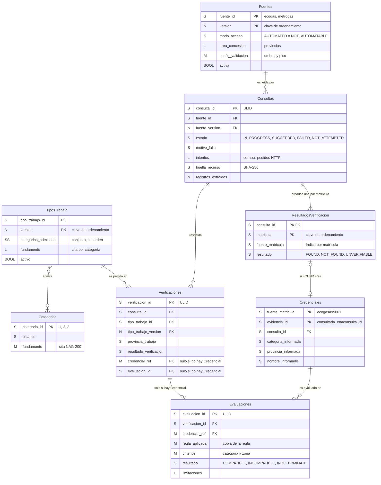
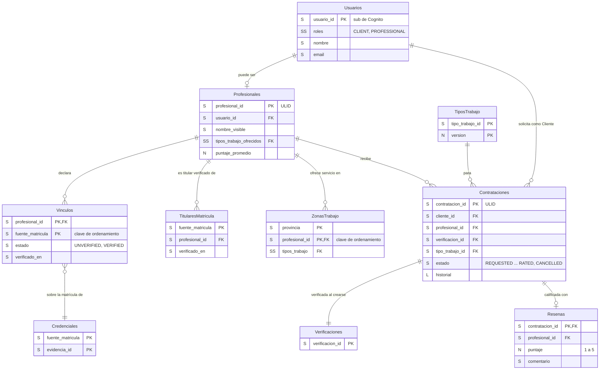

# Base de datos: esquema de colecciones (DynamoDB)

> Documento de diseño · Segunda entrega · Última revisión: 26/09/2026
> Cumple el ítem "Esquema de Base de Datos" de la consigna: tablas, campos, tipos de datos, claves primarias y foráneas, relaciones e índices principales. Por ser una base **no relacional**, se presenta como **esquema de colecciones (tablas) y documentos (ítems)**, más un diagrama entidad-relación lógico.
> Responde también al punto 5 de la devolución v2 ("persistencia de fuente, fecha y resultado de consulta").

## Índice

1. [Cómo leer este documento](#1-cómo-leer-este-documento)
2. [Por qué DynamoDB y por qué una tabla por entidad](#2-por-qué-dynamodb-y-por-qué-una-tabla-por-entidad)
3. [Convenciones](#3-convenciones)
4. [Diagrama entidad-relación del núcleo (P0)](#4-diagrama-entidad-relación-del-núcleo-p0)
5. [Diagrama entidad-relación completo (P0 a P2)](#5-diagrama-entidad-relación-completo-p0-a-p2)
6. [Tablas del P0](#6-tablas-del-p0)
7. [Tablas del P1](#7-tablas-del-p1)
8. [Tablas del P2](#8-tablas-del-p2)
9. [Patrones de acceso](#9-patrones-de-acceso)
10. [Integridad referencial y escrituras atómicas](#10-integridad-referencial-y-escrituras-atómicas)
11. [Datos personales: qué se guarda y qué no](#11-datos-personales-qué-se-guarda-y-qué-no)
12. [Datos semilla y ejemplos ficticios](#12-datos-semilla-y-ejemplos-ficticios)
13. [Capacidad, costos y retención](#13-capacidad-costos-y-retención)
14. [Archivos de esta carpeta](#14-archivos-de-esta-carpeta)

---

## 1. Cómo leer este documento

- Hay **15 tablas**: **8 del P0** (el núcleo de verificación), descriptas con todo detalle, y **7 de P1 y P2**, modeladas de forma más simple, como se acordó.
- Cada tabla tiene su **definición formal** en [`tablas/`](tablas/): un JSON **válido como entrada de `CreateTable`** de DynamoDB, que declara claves, índices y modo de facturación. Es el equivalente al DDL. Se puede aplicar tal cual en LocalStack (`aws dynamodb create-table --cli-input-json file://database/tablas/Fuentes.json`), y en la implementación se traduce a recursos `aws_dynamodb_table` de Terraform.
- Los **datos iniciales** (configuración de Fuentes, Categorías y Tipos de trabajo) están en [`seed/`](seed/): es el equivalente al DML. Los **ejemplos ficticios** de cada entidad están en [`seed/ejemplos-ficticios/`](seed/ejemplos-ficticios/).
- DynamoDB no aplica un esquema a los atributos que no son clave. **El esquema de cada documento lo garantiza la aplicación**, que valida cada ítem con Zod antes de escribirlo. Las tablas de campos de este documento son ese contrato.

---

## 2. Por qué DynamoDB y por qué una tabla por entidad

**DynamoDB** (decisión D5 de la primera entrega, que se mantiene):

- es la base administrada nativa del modelo serverless elegido: no hay servidor que mantener y escala a cero costo cuando no se usa;
- los **patrones de acceso son pocos y conocidos de antemano** ([§ 9](#9-patrones-de-acceso)), que es la condición para que una base clave-valor funcione bien;
- la mayoría de los datos son **documentos inmutables con historial** (Consultas, Credenciales, Evaluaciones), que se leen por clave y por fecha, sin *joins*;
- funciona igual en LocalStack y en AWS real.

**Una tabla por entidad** en vez de *single-table design* ([ADR-0004](../docs/adr/0004-una-tabla-dynamodb-por-entidad.md)): AWS recomienda una sola tabla con claves sobrecargadas para minimizar lecturas, pero eso hace que el esquema sea difícil de leer y revisar. Para este proyecto, que es académico, tiene volumen bajo y una consigna que pide mostrar tablas, campos, claves y relaciones, **priorizamos la legibilidad del modelo**. El costo es hacer, a veces, dos lecturas donde una tabla única haría una, lo cual es irrelevante con este volumen.

---

## 3. Convenciones

| Tema | Convención |
|---|---|
| Nombres de tablas | Plural, en español, `PascalCase` sin tildes (`TiposTrabajo`, `Resenas`). En la nube llevan el prefijo del entorno: `matricular-<entorno>-<tabla>`. |
| Nombres de atributos | `snake_case`, en español, sin tildes. |
| Tipos | Los de DynamoDB: **S** (string), **N** (número), **BOOL**, **L** (lista), **M** (mapa), **SS** (conjunto de strings, sin orden ni duplicados) y **NULL**. En los diagramas se usan esas mismas siglas. |
| Identificadores | **ULID** (26 caracteres, ordenables por tiempo), generados por la aplicación: `consulta_id`, `verificacion_id`, `evaluacion_id`, `profesional_id` y `contratacion_id`. Las Fuentes, Categorías y Tipos de trabajo usan identificadores legibles (`ecogas`, `artefacto-vivienda-unifamiliar`). |
| Claves compuestas | Cuando hace falta, `<fuente_id>#<matricula>` (por ejemplo `ecogas#99001`), en el atributo `fuente_matricula`. |
| Fechas | Strings **ISO-8601 en UTC**, con milisegundos (`2026-09-26T18:40:12.345Z`). Se ordenan bien como texto. La interfaz las muestra en hora de Argentina. |
| Provincias | Código normalizado en mayúsculas y sin tildes, del catálogo [`seed/provincias.json`](seed/provincias.json) (`CORDOBA`, `CIUDAD_AUTONOMA_DE_BUENOS_AIRES`). |
| "FK" | DynamoDB no tiene claves foráneas. Una **FK es un atributo que guarda la clave de un ítem de otra tabla**. La aplicación valida que el ítem exista antes de escribir ([§ 10](#10-integridad-referencial-y-escrituras-atómicas)). En los diagramas se marcan como `FK`. |
| Inmutabilidad | Las tablas de evidencia (`Consultas` una vez finalizadas, `ResultadosVerificacion`, `Credenciales`, `Evaluaciones` y `Verificaciones`) **no se modifican nunca**. Se escriben con la condición `attribute_not_exists`. |
| Versionado | La configuración (`Fuentes`, `TiposTrabajo`) usa `version` como clave de ordenamiento. Un cambio **agrega una versión**, no edita la anterior. |
| Enumerados | Strings en MAYÚSCULAS y **en inglés** (`SUCCEEDED`, `UNVERIFIABLE`, `COMPATIBLE`). El vocabulario del dominio sigue en español; el significado de cada código está en el [glosario](../CONTEXT.md#códigos-de-estado). |
| Opcionales | Un atributo opcional se guarda como `NULL`, **salvo que sea clave de un índice**: en ese caso se omite, porque DynamoDB no admite `NULL` en una clave de índice (y así los índices dispersos funcionan). |

---

## 4. Diagrama entidad-relación del núcleo (P0)

Diagrama **lógico**: muestra las entidades, sus claves y cómo se referencian. Cada entidad es una tabla de DynamoDB. Solo se muestran los atributos principales; los campos completos están en [§ 6](#6-tablas-del-p0).



Lectura de las cardinalidades más importantes:

- **Consultas → ResultadosVerificacion (1 a N):** una Consulta produce un Resultado por matrícula buscada. En el P0, N vale 1. En la búsqueda de P1 y en la revalidación de P3, una sola descarga del padrón resuelve todas las matrículas de esa Fuente.
- **Consultas → Verificaciones (1 a 0..N):** en el P0 cada Verificación tiene su propia Consulta. En la búsqueda (P1), las Verificaciones de todos los candidatos de una Fuente comparten la misma Consulta. La revalidación (P3) hace Consultas sin Verificaciones.
- **ResultadosVerificacion → Credenciales (0 o 1):** solo un Resultado `FOUND` crea una Credencial.
- **Verificaciones → Evaluaciones (0 o 1):** solo hay Evaluación si hay Credencial (INV-2).
- **Credenciales → Evaluaciones (1 a N):** la misma Credencial puede evaluarse para distintos Tipos de trabajo, y cada resultado es independiente.

---

## 5. Diagrama entidad-relación completo (P0 a P2)

Los módulos P1 (Profesionales y búsqueda) y P2 (usuarios y contratación) se apoyan en el núcleo. Para no repetir, el núcleo aparece resumido.



> La relación **Vínculos → Credenciales** es **lógica**, por `fuente_matricula`: un Vínculo apunta a una matrícula de una Fuente, no a una Credencial en particular. Siempre se usa la evidencia más reciente.

---

## 6. Tablas del P0

### Fuentes

Configuración **versionada** de cada padrón. Definición: [`tablas/Fuentes.json`](tablas/Fuentes.json). Datos: [`seed/fuentes.json`](seed/fuentes.json).

| Clave | Atributo | Tipo |
|---|---|---|
| Partición (PK) | `fuente_id` | S |
| Ordenamiento (SK) | `version` | N |

Índices secundarios: ninguno. Es una tabla chica (unos pocos ítems por Fuente).

| Campo | Tipo | Oblig. | Descripción |
|---|---|---|---|
| `fuente_id` | S | ✔ | Identificador legible: `ecogas`, `metrogas`. |
| `version` | N | ✔ | Versión de la configuración (1, 2, …). |
| `nombre` | S | ✔ | Nombre para mostrar: "Ecogas". |
| `distribuidora` | S | ✔ | Distribuidora que publica el padrón. |
| `licenciatarias` | L\<S\> | ✔ | Licenciatarias que agrupa: "Distribuidora de Gas del Centro", "Distribuidora de Gas Cuyana". |
| `area_concesion` | L\<S\> | ✔ | Códigos de las provincias donde la Distribuidora opera en **todo** el territorio. |
| `area_concesion_parcial` | L\<S\> | ✔ | Provincias donde opera solo en **parte** (por ejemplo, MetroGAS en Buenos Aires). Ahí el Criterio de zona es `INDETERMINATE`, porque el P0 modela la zona por provincia. Puede ser una lista vacía. |
| `modo_acceso` | S | ✔ | `AUTOMATED` \| `NOT_AUTOMATABLE`. |
| `adaptador` | S | ✔ | `ECOGAS_NEXT_RESOURCE` \| `NOT_AUTOMATABLE`. |
| `url_pagina` | S \| NULL | | Página donde el adaptador descubre el recurso. |
| `url_buscador_oficial` | S | ✔ | Buscador público, para mostrarle al Cliente. |
| `config_extraccion` | M \| NULL | | `prefijo_preferido` (S), `max_candidatos` (N), `claves_obligatorias` (L\<S\>), `claves_conocidas` (L\<S\>). |
| `config_reintentos` | M \| NULL | | `max_intentos` (N), `esperas_ms` (L\<N\>), `timeout_pedido_ms` (N), `timeout_consulta_ms` (N). |
| `config_validacion` | M \| NULL | | `umbral_caida` (N, 0 a 1), `piso_registros` (N). |
| `limitaciones` | L\<S\> | ✔ | Textos que se agregan a toda Evaluación sobre esta Fuente. |
| `activa` | BOOL | ✔ | Si se puede usar en nuevas Verificaciones. |
| `vigente_desde` | S | ✔ | Desde cuándo rige esta versión. |
| `vigente_hasta` | S \| NULL | | Hasta cuándo rigió (nulo en la versión vigente). |
| `creada_en` | S | ✔ | Fecha de carga. |

### Categorias

Catálogo de categorías de matrícula **para mostrar**. El algoritmo no lo usa para comparar: las reglas están en `TiposTrabajo`. **No tiene ningún campo de orden o nivel, a propósito** (INV-7). Definición: [`tablas/Categorias.json`](tablas/Categorias.json). Datos: [`seed/categorias.json`](seed/categorias.json).

| Clave | Atributo | Tipo |
|---|---|---|
| PK | `categoria_id` | S (`"1"`, `"2"`, `"3"`, tal como las publica la Fuente) |

| Campo | Tipo | Oblig. | Descripción |
|---|---|---|---|
| `categoria_id` | S | ✔ | Código tal como aparece en el padrón. |
| `nombre` | S | ✔ | "Primera categoría". |
| `alcance` | S | ✔ | Resumen en lenguaje claro de lo que habilita. |
| `fundamento` | M | ✔ | `norma` (S), `articulo` (S), `cita` (S), `url` (S). |
| `version` | N | ✔ | Versión del texto. |

### TiposTrabajo

Reglas de categoría, **versionadas**. Definición: [`tablas/TiposTrabajo.json`](tablas/TiposTrabajo.json). Datos: [`seed/tipos-trabajo.json`](seed/tipos-trabajo.json). Fundamentos: [`docs/reglas-de-categoria.md`](../docs/reglas-de-categoria.md).

| Clave | Atributo | Tipo |
|---|---|---|
| PK | `tipo_trabajo_id` | S |
| SK | `version` | N |

| Campo | Tipo | Oblig. | Descripción |
|---|---|---|---|
| `tipo_trabajo_id` | S | ✔ | `artefacto-vivienda-unifamiliar`, `artefacto-vivienda-general`, `comercio-artefacto-alto-consumo`. |
| `version` | N | ✔ | Versión de la regla. |
| `codigo` | S | ✔ | Código corto para la documentación: `A1`, `A2`, `B`. |
| `nombre` | S | ✔ | Nombre para el Cliente. |
| `descripcion` | S | ✔ | Explicación en lenguaje claro. |
| `condiciones` | L\<S\> | ✔ | Condiciones que asume el tipo; se muestran al Cliente y se copian como Limitación. |
| `categorias_admitidas` | SS | ✔ | **Conjunto** de categorías que pueden hacer el trabajo. |
| `fundamento` | L\<M\> | ✔ | Uno por categoría del catálogo: `categoria` (S), `admitida` (BOOL), `norma` (S), `articulo` (S), `cita` (S), `url` (S) y, opcionalmente, `nota` (S) con la explicación de por qué una categoría no está admitida. |
| `limitaciones` | L\<S\> | ✔ | Limitaciones propias del tipo (puede ser una lista vacía). |
| `tipo_recomendado_si_duda` | S \| NULL | | Tipo más restrictivo que se sugiere si el Cliente no sabe si cumple las condiciones (A1 → A2). |
| `activo` | BOOL | ✔ | Si se ofrece en nuevas Verificaciones. |
| `vigente_desde` | S | ✔ | |
| `vigente_hasta` | S \| NULL | | |
| `creado_en` | S | ✔ | |

### Consultas

**Cada lectura de una Fuente**, con sus Intentos. Es la tabla que responde "de dónde lo sabemos y cuándo". Definición: [`tablas/Consultas.json`](tablas/Consultas.json). Ejemplos: [`seed/ejemplos-ficticios/consultas.json`](seed/ejemplos-ficticios/consultas.json).

| Clave | Atributo | Tipo |
|---|---|---|
| PK | `consulta_id` | S (ULID) |

| Índice (GSI) | PK | SK | Proyección | Para qué |
|---|---|---|---|---|
| `por-fuente` | `fuente_id` | `iniciada_en` | ALL | Historial de Consultas de una Fuente (monitoreo, informe de fallas). |
| `exitosas-por-fuente` (disperso) | `exito_fuente_id` | `finalizada_en` | `registros_extraidos`, `huella_recurso` | **Última Consulta exitosa** de la Fuente, para la validación V5. Es disperso: solo las Consultas `SUCCEEDED` tienen `exito_fuente_id`. |

| Campo | Tipo | Oblig. | Descripción |
|---|---|---|---|
| `consulta_id` | S | ✔ | ULID. |
| `fuente_id` | S | ✔ | FK → `Fuentes`. |
| `fuente_version` | N | ✔ | FK → `Fuentes`: versión de la configuración usada. |
| `origen` | S | ✔ | `VERIFICATION` \| `REVALIDATION` (P3) \| `SEARCH` (P1). |
| `matriculas_buscadas` | L\<S\> | ✔ | Matrículas que se buscaron. |
| `estado` | S | ✔ | `IN_PROGRESS` \| `SUCCEEDED` \| `FAILED` \| `NOT_ATTEMPTED`. |
| `motivo_falla` | S \| NULL | | Para `FAILED`: `SOURCE_UNAVAILABLE` \| `EXTRACTION_FAILED` \| `INTERRUPTED` (falla de MatriculAR, que no cuenta en la salud de la Fuente). Para `NOT_ATTEMPTED`: `SOURCE_NOT_AUTOMATABLE`. |
| `detalle_falla` | M \| NULL | | `validacion` (S: `V1`…`V5` o nulo), `descripcion` (S), `esperado` (S), `obtenido` (S). |
| `iniciada_en` | S | ✔ | Momento del registro, **antes** del primer pedido. |
| `plazo_maximo_en` | S | ✔ | Si la Consulta sigue `IN_PROGRESS` después de este momento, se lee como `FAILED` con motivo `INTERRUPTED`. |
| `finalizada_en` | S \| ausente | | Momento en que terminó. **Se omite mientras la Consulta está `IN_PROGRESS`**, porque es clave del índice `exitosas-por-fuente` y DynamoDB no admite `NULL` en una clave de índice. |
| `intentos` | L\<M\> | ✔ | Cada Intento: `numero` (N), `iniciado_en` (S), `duracion_ms` (N), `resultado` (S: `SUCCESS` o un motivo), `reintentable` (BOOL), `pedidos` (L\<M\>: `url`, `metodo`, `status`, `content_type`, `bytes`, `duracion_ms`, `error`). **Nunca el cuerpo de la respuesta.** Lista vacía si la Consulta es `NOT_ATTEMPTED`. |
| `url_recurso` | S \| NULL | | URL del recurso efectivamente leído. |
| `huella_recurso` | S \| NULL | | SHA-256 del recurso leído: identifica *qué versión* del padrón se leyó sin guardarlo. |
| `bytes_recurso` | N \| NULL | | Tamaño del recurso. |
| `registros_extraidos` | N \| NULL | | Cantidad de registros válidos. |
| `resumen` | M \| NULL | | `por_categoria` (M), `por_provincia` (M): conteos sin datos personales. |
| `claves_no_esperadas` | L\<S\> | ✔ | Claves nuevas detectadas en los registros (vacía si no hay). |
| `exito_fuente_id` | S \| ausente | | Copia de `fuente_id` **solo** si `estado = SUCCEEDED`. Es la clave del índice disperso. |

Reglas de escritura:

- Se crea con `estado = IN_PROGRESS` antes del primer pedido, con condición `attribute_not_exists(consulta_id)`.
- Se finaliza con **una sola** actualización condicionada a `estado = IN_PROGRESS`. Después de eso **no cambia más**.

### ResultadosVerificacion

Un ítem por **matrícula buscada** en cada Consulta. Definición: [`tablas/ResultadosVerificacion.json`](tablas/ResultadosVerificacion.json). Ejemplos: [`seed/ejemplos-ficticios/resultados-verificacion.json`](seed/ejemplos-ficticios/resultados-verificacion.json).

| Clave | Atributo | Tipo |
|---|---|---|
| PK | `consulta_id` | S |
| SK | `matricula` | S |

| Índice (GSI) | PK | SK | Proyección | Para qué |
|---|---|---|---|---|
| `por-matricula` | `fuente_matricula` | `determinado_en` | ALL | Historial de resultados de una matrícula, incluidos `NOT_FOUND` y `UNVERIFIABLE` (que no generan Credencial). |

| Campo | Tipo | Oblig. | Descripción |
|---|---|---|---|
| `consulta_id` | S | ✔ | FK → `Consultas`. |
| `matricula` | S | ✔ | Matrícula buscada, normalizada. |
| `fuente_id` | S | ✔ | FK → `Fuentes`. |
| `fuente_matricula` | S | ✔ | `<fuente_id>#<matricula>`. |
| `resultado` | S | ✔ | `FOUND` \| `NOT_FOUND` \| `UNVERIFIABLE`. |
| `determinado_en` | S | ✔ | Igual a `finalizada_en` de la Consulta. |
| `credencial_evidencia_id` | S \| NULL | | Si es `FOUND`: FK → `Credenciales` (junto con `fuente_matricula`). |

### Credenciales

**Evidencia inmutable** de que una matrícula figura en una Fuente. El historial de una matrícula se lee con la clave de partición. Definición: [`tablas/Credenciales.json`](tablas/Credenciales.json). Ejemplos: [`seed/ejemplos-ficticios/credenciales.json`](seed/ejemplos-ficticios/credenciales.json).

| Clave | Atributo | Tipo |
|---|---|---|
| PK | `fuente_matricula` | S (`ecogas#99001`) |
| SK | `evidencia_id` | S (`<consultada_en>#<consulta_id>`: se ordena por fecha y es única aunque haya dos Consultas en el mismo milisegundo) |

Índices secundarios: ninguno. La última evidencia se obtiene con `Query` en orden descendente y `Limit 1`.

| Campo | Tipo | Oblig. | Descripción |
|---|---|---|---|
| `fuente_matricula` | S | ✔ | Clave de partición. |
| `evidencia_id` | S | ✔ | Clave de ordenamiento. |
| `fuente_id` | S | ✔ | FK → `Fuentes`. |
| `matricula` | S | ✔ | Matrícula normalizada. |
| `consulta_id` | S | ✔ | FK → `Consultas`: la Consulta que la produjo. |
| `consultada_en` | S | ✔ | Momento en que se obtuvo el recurso. |
| `nombre_informado` | S | ✔ | Nombre y apellido tal como los publica la Fuente, normalizados. Se guarda para que el Cliente confirme la identidad del gasista. |
| `categoria_informada` | S | ✔ | Tal como la publica la Fuente (`"1"`, `"2"`, `"3"`, o vacío). |
| `provincia_informada` | S | ✔ | Código de provincia (el domicilio del matriculado). |
| `localidad_informada` | S | ✔ | |
| `creada_en` | S | ✔ | |

Reglas: se escribe **una sola vez**, con la condición `attribute_not_exists(fuente_matricula)`. Nunca se actualiza ni se borra (INV-1). **No existe ningún atributo de contacto** (INV-9).

### Verificaciones

Cada **pedido** de un Cliente, o del propio sistema en P1 y P2: agrupa la Consulta, el resultado y, si corresponde, la Evaluación. Definición: [`tablas/Verificaciones.json`](tablas/Verificaciones.json). Ejemplos: [`seed/ejemplos-ficticios/verificaciones.json`](seed/ejemplos-ficticios/verificaciones.json).

| Clave | Atributo | Tipo |
|---|---|---|
| PK | `verificacion_id` | S (ULID) |

| Índice (GSI) | PK | SK | Proyección | Para qué |
|---|---|---|---|---|
| `por-matricula` | `fuente_matricula` | `solicitada_en` | ALL | Verificaciones de una matrícula (historial en la interfaz). |

| Campo | Tipo | Oblig. | Descripción |
|---|---|---|---|
| `verificacion_id` | S | ✔ | ULID. |
| `solicitada_en` | S | ✔ | |
| `origen` | S | ✔ | `DIRECT` (P0) \| `SEARCH` (P1) \| `HIRING` (P2). |
| `solicitante_id` | S \| NULL | | FK → `Usuarios` (P2). Nulo en el P0, donde la consulta es anónima. |
| `fuente_id` | S | ✔ | FK → `Fuentes`. |
| `matricula` | S | ✔ | |
| `fuente_matricula` | S | ✔ | |
| `tipo_trabajo_id` | S | ✔ | FK → `TiposTrabajo`. |
| `tipo_trabajo_version` | N | ✔ | FK → `TiposTrabajo` (versión vigente al pedir). |
| `provincia_trabajo` | S | ✔ | Código de provincia donde se hará el trabajo. |
| `consulta_id` | S | ✔ | FK → `Consultas`. |
| `resultado_verificacion` | S | ✔ | `FOUND` \| `NOT_FOUND` \| `UNVERIFIABLE`. |
| `credencial_ref` | M \| NULL | | `fuente_matricula` y `evidencia_id` de la Credencial nueva. Solo si es `FOUND`. |
| `evaluacion_id` | S \| NULL | | FK → `Evaluaciones`. Solo si hay Credencial. |
| `resultado_evaluacion` | S \| NULL | | Copia del resultado, para listar sin leer la Evaluación. |
| `credencial_previa_ref` | M \| NULL | | Si es `UNVERIFIABLE`: la última Credencial anterior, como contexto. |
| `mensaje` | S | ✔ | Texto principal que se mostró al Cliente. |

### Evaluaciones

Resultado de aplicar un Tipo de trabajo a una Credencial, con **copia de la regla aplicada**. Definición: [`tablas/Evaluaciones.json`](tablas/Evaluaciones.json). Ejemplos: [`seed/ejemplos-ficticios/evaluaciones.json`](seed/ejemplos-ficticios/evaluaciones.json).

| Clave | Atributo | Tipo |
|---|---|---|
| PK | `evaluacion_id` | S (ULID) |

Índices secundarios: ninguno. Se accede desde la Verificación.

| Campo | Tipo | Oblig. | Descripción |
|---|---|---|---|
| `evaluacion_id` | S | ✔ | ULID. |
| `verificacion_id` | S | ✔ | FK → `Verificaciones`. |
| `credencial_ref` | M | ✔ | FK → `Credenciales`: `fuente_matricula` y `evidencia_id`. |
| `tipo_trabajo_id` | S | ✔ | FK → `TiposTrabajo`. |
| `tipo_trabajo_version` | N | ✔ | |
| `fuente_version` | N | ✔ | Versión de la Fuente de la que se tomaron el Área de concesión y las Limitaciones. |
| `regla_aplicada` | M | ✔ | **Copia**: `categorias_admitidas` (SS), `condiciones` (L\<S\>), `fundamento` (L\<M\>). |
| `provincia_trabajo` | S | ✔ | |
| `area_concesion_aplicada` | L\<S\> | ✔ | **Copia** del Área de concesión usada. |
| `criterios` | M | ✔ | `categoria`: {`resultado`, `categoria_informada`, `fundamento`}; `zona`: {`resultado`, `fundamento`}. Resultado: `MET` \| `NOT_MET` \| `INDETERMINATE`. |
| `resultado` | S | ✔ | `COMPATIBLE` \| `INCOMPATIBLE` \| `INDETERMINATE`. |
| `limitaciones` | L\<S\> | ✔ | Textos finales, incluida siempre la de Vigencia. |
| `evaluada_en` | S | ✔ | |

---

## 7. Tablas del P1

Modeladas más simples: se detallan al llegar a ese módulo.

### Profesionales

| Clave | Atributo | Tipo |
|---|---|---|
| PK | `profesional_id` | S (ULID) |

GSI `por-usuario`: PK `usuario_id` → el perfil de un usuario.

| Campo | Tipo | Oblig. | Descripción |
|---|---|---|---|
| `profesional_id` | S | ✔ | |
| `usuario_id` | S | ✔ | FK → `Usuarios` (P2; en P1 es el `sub` de Cognito). |
| `nombre_visible` | S | ✔ | Nombre que ve el Cliente. |
| `descripcion` | S | | Presentación libre. |
| `tipos_trabajo_ofrecidos` | SS | ✔ | FK → `TiposTrabajo`. |
| `estado_perfil` | S | ✔ | `ACTIVE` \| `PAUSED`. |
| `puntaje_promedio` | N \| NULL | | Se actualiza al crear una Reseña (P2). |
| `cantidad_resenas` | N | ✔ | |
| `creado_en`, `actualizado_en` | S | ✔ | |

### Vinculos

| Clave | Atributo | Tipo |
|---|---|---|
| PK | `profesional_id` | S |
| SK | `fuente_matricula` | S |

GSI `por-matricula`: PK `fuente_matricula`, SK `estado` → listar quiénes declararon una matrícula. Es informativo: **la unicidad del Vínculo verificado la garantiza [`TitularesMatricula`](#titularesmatricula)**, porque un índice secundario es eventualmente consistente y dos confirmaciones simultáneas podrían pasar.

| Campo | Tipo | Oblig. | Descripción |
|---|---|---|---|
| `profesional_id` | S | ✔ | FK → `Profesionales`. |
| `fuente_matricula` | S | ✔ | Matrícula declarada (referencia lógica a `Credenciales`). |
| `estado` | S | ✔ | `UNVERIFIED` \| `VERIFIED`. |
| `metodo` | S | ✔ | `SOURCE_EMAIL_CODE`. |
| `codigo_hash` | S \| NULL | | Hash del código enviado. **Nunca** el código en claro ni el email. |
| `codigo_vence_en` | S \| NULL | | |
| `intentos_codigo` | N | ✔ | Para limitar intentos de adivinar el código. |
| `declarado_en` | S | ✔ | |
| `verificado_en` | S \| NULL | | |

### TitularesMatricula

Garantiza que una matrícula tenga **a lo sumo un** Vínculo `VERIFIED`. Al confirmar un código, una misma transacción (`TransactWriteItems`) pasa el Vínculo a `VERIFIED` y escribe este ítem con la condición `attribute_not_exists(fuente_matricula)`. Si otro Profesional ya verificó esa matrícula, la transacción entera falla y el Vínculo sigue `UNVERIFIED`.

| Clave | Atributo | Tipo |
|---|---|---|
| PK | `fuente_matricula` | S |

| Campo | Tipo | Oblig. | Descripción |
|---|---|---|---|
| `fuente_matricula` | S | ✔ | Matrícula verificada. |
| `profesional_id` | S | ✔ | FK → `Profesionales`: su titular verificado. |
| `verificado_en` | S | ✔ | |

### ZonasTrabajo

Tabla de **búsqueda**: un ítem por provincia y Profesional. Resuelve la búsqueda "Profesionales en esta provincia" sin recorrer toda la base.

| Clave | Atributo | Tipo |
|---|---|---|
| PK | `provincia` | S |
| SK | `profesional_id` | S |

| Campo | Tipo | Oblig. | Descripción |
|---|---|---|---|
| `provincia` | S | ✔ | Código de provincia. |
| `profesional_id` | S | ✔ | FK → `Profesionales`. |
| `localidades` | L\<S\> \| NULL | | Nulo significa toda la provincia. |
| `tipos_trabajo` | SS | ✔ | FK → `TiposTrabajo`: los que ofrece en esa provincia. |
| `actualizado_en` | S | ✔ | |

---

## 8. Tablas del P2

### Usuarios

| Clave | Atributo | Tipo |
|---|---|---|
| PK | `usuario_id` | S (el `sub` de Cognito) |

| Campo | Tipo | Oblig. | Descripción |
|---|---|---|---|
| `usuario_id` | S | ✔ | Identificador de Cognito. **Las contraseñas no se guardan en la base**: las administra Cognito. |
| `roles` | SS | ✔ | `CLIENT`, `PROFESSIONAL`. |
| `nombre` | S | ✔ | |
| `email` | S | ✔ | Email de la cuenta (dato propio del usuario, que él mismo carga). |
| `creado_en` | S | ✔ | |

### Contrataciones

| Clave | Atributo | Tipo |
|---|---|---|
| PK | `contratacion_id` | S (ULID) |

| Índice (GSI) | PK | SK | Para qué |
|---|---|---|---|
| `por-cliente` | `cliente_id` | `creada_en` | "Mis contrataciones" del Cliente. |
| `por-profesional` | `profesional_id` | `creada_en` | Bandeja del Profesional. |

| Campo | Tipo | Oblig. | Descripción |
|---|---|---|---|
| `contratacion_id` | S | ✔ | |
| `cliente_id` | S | ✔ | FK → `Usuarios`. |
| `profesional_id` | S | ✔ | FK → `Profesionales`. |
| `tipo_trabajo_id` | S | ✔ | FK → `TiposTrabajo`. |
| `provincia_trabajo`, `localidad_trabajo` | S | ✔ | |
| `descripcion` | S | ✔ | Qué necesita el Cliente. |
| `verificacion_id` | S | ✔ | FK → `Verificaciones`: la Verificación hecha al crearla. |
| `resultado_al_crear` | S | ✔ | Copia del resultado: `COMPATIBLE`, `INDETERMINATE`, `NOT_FOUND` o `UNVERIFIABLE`. (`INCOMPATIBLE` no llega a crear la Contratación.) |
| `advertencia_aceptada` | BOOL | ✔ | Si el Cliente confirmó pese a una advertencia. |
| `estado` | S | ✔ | `REQUESTED` \| `ACCEPTED` \| `COMPLETED` \| `RATED` \| `CANCELLED`. |
| `historial` | L\<M\> | ✔ | Cada transición: `estado`, `en`, `actor_id`, `motivo`. |
| `creada_en`, `actualizada_en` | S | ✔ | |

Las transiciones se escriben con una actualización **condicionada al estado esperado**, lo que evita que dos transiciones simultáneas se pisen.

### Resenas

| Clave | Atributo | Tipo |
|---|---|---|
| PK | `contratacion_id` | S (una Reseña por Contratación) |

GSI `por-profesional`: PK `profesional_id`, SK `creada_en` → Reseñas de un Profesional.

| Campo | Tipo | Oblig. | Descripción |
|---|---|---|---|
| `contratacion_id` | S | ✔ | FK → `Contrataciones`. |
| `profesional_id` | S | ✔ | FK → `Profesionales`. |
| `cliente_id` | S | ✔ | FK → `Usuarios`. |
| `puntaje` | N | ✔ | Entero de 1 a 5. |
| `comentario` | S | | |
| `creada_en` | S | ✔ | |

---

## 9. Patrones de acceso

Todas las lecturas del sistema, con la tabla o el índice que las resuelve. **Ninguna requiere un `Scan` de una tabla que crezca**: los `Scan` se limitan a las tablas de configuración, que tienen pocos ítems.

| # | Módulo | Patrón | Tabla / índice | Operación |
|---|---|---|---|---|
| AP-01 | P0 | Versión vigente de una Fuente | `Fuentes` | `Query` PK=`fuente_id`, descendente, `Limit 1` |
| AP-02 | P0 | Listar Fuentes activas | `Fuentes` | `Scan` (tabla de configuración) y filtrar la última versión |
| AP-03 | P0 | Listar Categorías | `Categorias` | `Scan` (3 ítems) |
| AP-04 | P0 | Versión vigente de un Tipo de trabajo | `TiposTrabajo` | `Query` PK=`tipo_trabajo_id`, descendente, `Limit 1` |
| AP-05 | P0 | Listar Tipos de trabajo activos | `TiposTrabajo` | `Scan` (tabla de configuración) y filtrar |
| AP-06 | P0 | Registrar una Consulta `IN_PROGRESS` | `Consultas` | `PutItem` condicional |
| AP-07 | P0 | Última Consulta exitosa de una Fuente (V5) | GSI `exitosas-por-fuente` | `Query` PK=`exito_fuente_id`, descendente, `Limit 1` |
| AP-08 | P0 | Finalizar una Consulta y guardar resultados, Credencial, Evaluación y Verificación | varias | `TransactWriteItems` ([§ 10](#10-integridad-referencial-y-escrituras-atómicas)) |
| AP-09 | P0 | Última Credencial de una matrícula | `Credenciales` | `Query` PK=`fuente_matricula`, descendente, `Limit 1` |
| AP-10 | P0 | Historial de Credenciales de una matrícula | `Credenciales` | `Query` PK=`fuente_matricula` |
| AP-11 | P0 | Historial de resultados de una matrícula | GSI `por-matricula` (ResultadosVerificacion) | `Query` PK=`fuente_matricula` |
| AP-12 | P0 | Obtener una Verificación | `Verificaciones` | `GetItem` |
| AP-13 | P0 | Obtener la Evaluación de una Verificación | `Evaluaciones` | `GetItem` por `evaluacion_id` |
| AP-14 | P0 | Verificaciones de una matrícula | GSI `por-matricula` (Verificaciones) | `Query` |
| AP-15 | P0 | Consultas de una Fuente por fecha (monitoreo) | GSI `por-fuente` | `Query` con rango de fechas |
| AP-16 | P1 | Perfil del usuario autenticado | GSI `por-usuario` (Profesionales) | `Query` |
| AP-17 | P1 | Vínculos de un Profesional | `Vinculos` | `Query` PK=`profesional_id` |
| AP-18 | P1 | ¿La matrícula ya tiene un titular verificado? | `TitularesMatricula` | `GetItem` con lectura consistente. La unicidad se garantiza con la escritura condicional al confirmar. |
| AP-19 | P1 | Profesionales en una provincia que ofrecen un tipo de trabajo | `ZonasTrabajo` | `Query` PK=`provincia`, filtro por `tipos_trabajo` |
| AP-20 | P2 | Contrataciones de un Cliente | GSI `por-cliente` | `Query` |
| AP-21 | P2 | Contrataciones de un Profesional | GSI `por-profesional` (Contrataciones) | `Query` |
| AP-22 | P2 | Transición de estado de una Contratación | `Contrataciones` | `UpdateItem` condicional |
| AP-23 | P2 | Reseñas de un Profesional | GSI `por-profesional` (Resenas) | `Query` |
| AP-24 | P2 | Usuario por id | `Usuarios` | `GetItem` |

---

## 10. Integridad referencial y escrituras atómicas

Como DynamoDB no tiene claves foráneas, la integridad la garantiza la aplicación con tres mecanismos:

1. **Validación previa.** Antes de crear una Verificación se leen la Fuente y el Tipo de trabajo vigentes (AP-01 y AP-04). Si no existen, el pedido se rechaza con `404`; si existen pero no están activos, con `400`. En los dos casos no se escribe nada.
2. **Transacción al finalizar.** Una vez leída la Fuente, se escribe todo junto con `TransactWriteItems`, sin que puedan quedar estados intermedios:
   - `UpdateItem` sobre `Consultas`: finalizar, con la condición `estado = IN_PROGRESS`;
   - `PutItem` sobre `ResultadosVerificacion`, uno por matrícula;
   - `PutItem` sobre `Credenciales`, si es `FOUND`, con `attribute_not_exists`;
   - `PutItem` sobre `Evaluaciones`, si hay Credencial, con `attribute_not_exists`;
   - `PutItem` sobre `Verificaciones`, con `attribute_not_exists`.

   Si la transacción falla, no queda ninguna de esas escrituras. La Consulta queda `IN_PROGRESS` y, al vencer su plazo, se lee como `FAILED` con motivo `INTERRUPTED`, así el intento sigue registrado.
3. **Escrituras condicionales.** Las condiciones `attribute_not_exists` hacen que la evidencia sea **inmutable** y que un reintento del mismo paso sea **idempotente**: no pisa lo que ya estaba escrito.

En la revalidación de P3, con muchas matrículas por Consulta, los Resultados se escriben en lotes (`BatchWriteItem`), cada uno idempotente. La Consulta se finaliza al final.

---

## 11. Datos personales: qué se guarda y qué no

| Dato | ¿Se guarda? | Dónde | Por qué |
|---|---|---|---|
| Matrícula | Sí | `Credenciales`, `ResultadosVerificacion`, `Verificaciones` | Es el objeto de la verificación. |
| Nombre y apellido que publica la Fuente | **Sí** | `Credenciales.nombre_informado` | El Cliente confirma que la matrícula pertenece a la persona que tiene enfrente. |
| Categoría, provincia y localidad informadas | Sí | `Credenciales` | Necesarias para evaluar y explicar. |
| Email que publica la Fuente | **No** | — | Solo se usa **en memoria** para enviar el código del Vínculo (P1). |
| Teléfono y barrio que publica la Fuente | **No** | — | No aportan a la verificación. |
| Padrón completo | **No** | — | Se procesa en memoria. Solo se guardan la huella SHA-256 y los conteos ([ADR-0002](../docs/adr/0002-consulta-bajo-demanda-sin-copia-del-padron.md)). |
| Cuerpo de las respuestas HTTP | **No** | — | Solo metadatos del pedido. |
| Cuenta del usuario (nombre, email) | Sí (P2) | `Usuarios` | Dato propio del usuario, necesario para operar su cuenta. |
| Contraseñas | **No** | — | Las administra Cognito. |
| Código de verificación del Vínculo | Solo su hash | `Vinculos.codigo_hash` | |

---

## 12. Datos semilla y ejemplos ficticios

| Archivo | Contenido | ¿Se carga en qué entornos? |
|---|---|---|
| [`seed/fuentes.json`](seed/fuentes.json) | Configuración real de `ecogas` y `metrogas` (versión 1). | Todos. |
| [`seed/categorias.json`](seed/categorias.json) | Catálogo de las 3 categorías con su cita de la NAG-200. | Todos. |
| [`seed/tipos-trabajo.json`](seed/tipos-trabajo.json) | Los 3 Tipos de trabajo (A1, A2, B), versión 1, con fundamento. | Todos. |
| [`seed/provincias.json`](seed/provincias.json) | Catálogo de las 24 provincias (incluida la Ciudad Autónoma de Buenos Aires), con código y nombre. Es un catálogo estático que se empaqueta con las funciones, no una tabla. | Se empaqueta con el código. |
| [`seed/ejemplos-ficticios/`](seed/ejemplos-ficticios/) | Ítems de ejemplo de `Consultas`, `ResultadosVerificacion`, `Credenciales`, `Verificaciones` y `Evaluaciones` para los escenarios S1, S2, S6, S7 y S9 del [modelo de dominio](../docs/modelo-de-dominio.md#9-escenarios). | **Ninguno.** Son documentación y fixtures de tests. **Nunca se cargan en la base de un entorno** (INV-12: el sistema distingue lo que puede conocer de lo que solo simula). |

Los archivos de seed son **listas de ítems en JSON plano**. El script de carga (etapa de implementación) los convierte al formato de DynamoDB y los escribe con `BatchWriteItem`. Para cambiar una regla se agrega un archivo o ítem con una **nueva versión**; nunca se edita una versión que ya se cargó.

---

## 13. Capacidad, costos y retención

- **Modo de facturación:** `PAY_PER_REQUEST` (bajo demanda) en todas las tablas. No hay que estimar capacidad, y con el volumen de un proyecto académico el costo es de centavos (en AWS real lo cubren los créditos del Free plan; ver [arquitectura](../docs/arquitectura.md#7-entornos-y-costos)).
- **Tamaño de los ítems:** el más grande es la Consulta, con hasta 3 Intentos y unos 20 pedidos cada uno, que queda muy por debajo del límite de 400 KB de DynamoDB.
- **Volumen esperado:** una Verificación genera de 3 a 5 ítems de unos pocos KB (Consulta, Resultado y Verificación, más Credencial y Evaluación si la matrícula figura). Mil Verificaciones ocupan del orden de 10 MB.
- **Retención:** en el P0 se conserva todo, porque la evidencia histórica es parte del valor del sistema. La política de retención (por ejemplo, archivar Consultas de más de un año) se define en la fase 2.
- **Backups:** la recuperación a un punto en el tiempo (PITR) queda desactivada en el P0 y se evalúa para AWS real en la etapa 4.

---

## 14. Archivos de esta carpeta

```
database/
├── README.md                          este documento (esquema de colecciones)
├── tablas/                            definición de cada tabla (formato CreateTable de DynamoDB)
│   ├── Fuentes.json
│   ├── Categorias.json
│   ├── TiposTrabajo.json
│   ├── Consultas.json
│   ├── ResultadosVerificacion.json
│   ├── Credenciales.json
│   ├── Verificaciones.json
│   ├── Evaluaciones.json
│   ├── Profesionales.json              P1
│   ├── Vinculos.json                   P1
│   ├── TitularesMatricula.json         P1
│   ├── ZonasTrabajo.json               P1
│   ├── Usuarios.json                   P2
│   ├── Contrataciones.json             P2
│   └── Resenas.json                    P2
└── seed/                              datos iniciales (configuración real)
    ├── fuentes.json
    ├── categorias.json
    ├── tipos-trabajo.json
    ├── provincias.json
    └── ejemplos-ficticios/            solo documentación y tests; nunca se cargan
        ├── README.md
        ├── consultas.json
        ├── resultados-verificacion.json
        ├── credenciales.json
        ├── verificaciones.json
        └── evaluaciones.json
```
