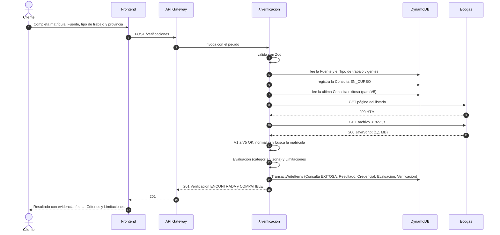
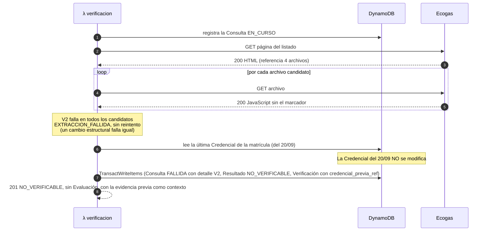
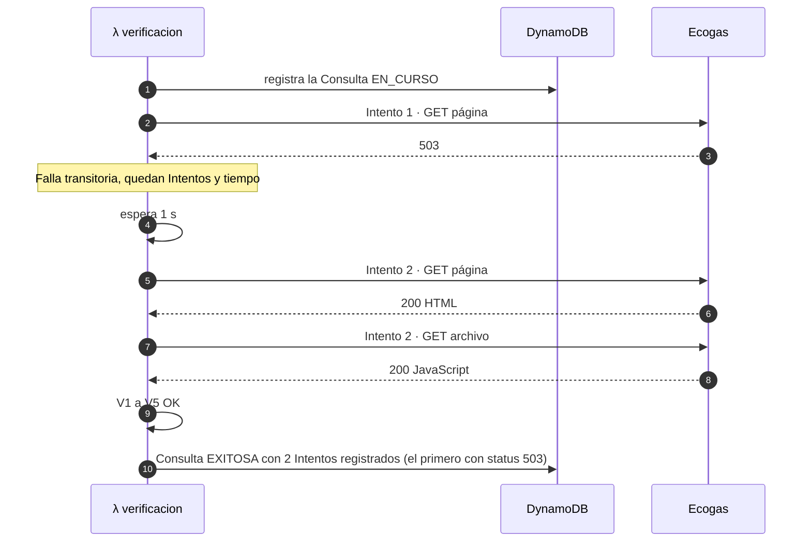
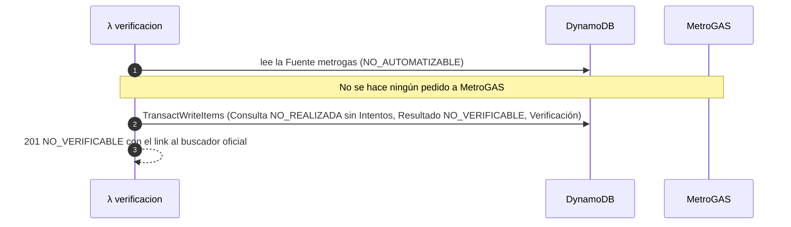

# API

> Documento de diseño · Segunda entrega · Última revisión: 26/09/2026
> Responde al punto 8 de la devolución v2 ("una interfaz mínima o endpoint que permita recorrer el flujo completo"), **a nivel de contrato**. La implementación empieza cuando se apruebe esta entrega.
> Relacionados: [modelo de dominio](modelo-de-dominio.md) · [fuentes y adaptadores](fuentes-y-adaptadores.md) · [base de datos](../database/README.md) · [pantalla del frontend](../frontend/README.md)

## Índice

1. [Convenciones](#1-convenciones)
2. [Endpoints del P0](#2-endpoints-del-p0)
3. [POST /verificaciones](#3-post-verificaciones)
4. [Resto de los endpoints del P0](#4-resto-de-los-endpoints-del-p0)
5. [Errores](#5-errores)
6. [Secuencias](#6-secuencias)
7. [Endpoints de P1 y P2 (resumen)](#7-endpoints-de-p1-y-p2-resumen)

---

## 1. Convenciones

| Tema | Convención |
|---|---|
| Base | `https://<api-id>.execute-api.<región>.amazonaws.com/v1`. En local es la URL que expone LocalStack. `v1` es el *stage* de API Gateway. |
| Formato | JSON en UTF-8. Los nombres de campos en `snake_case`, iguales a los de la base. |
| Fechas | ISO-8601 en UTC con milisegundos. La interfaz las muestra en hora de Argentina. |
| Identificadores | ULID (26 caracteres). |
| Autenticación | **P0: ninguna.** La consulta de una matrícula es pública. P1 y P2 usan un token de Cognito en `Authorization: Bearer …`. |
| Límite de uso | `POST /verificaciones`: 2 pedidos por segundo con ráfagas de 5 (configurable). Si se excede, API Gateway responde `429`. |
| CORS | Solo el origen del frontend. |
| Validación | Zod, con esquemas compartidos con el frontend. |

> **Principio clave: una Fuente que falla no es un error HTTP.** Si Ecogas no responde o cambió su formato, `POST /verificaciones` responde **`201 Created`** con una Verificación cuyo `resultado_verificacion` es `NO_VERIFICABLE`. Es un resultado del dominio, y el cliente tiene que mostrarlo. Los códigos `4xx` quedan para los errores del pedido y los `5xx` para las fallas del propio MatriculAR.

---

## 2. Endpoints del P0

| Método | Ruta | Para qué | Caso de uso |
|---|---|---|---|
| `POST` | `/verificaciones` | **El recorrido completo:** consulta la Fuente, guarda la evidencia, evalúa y responde. | Verificar |
| `GET` | `/verificaciones/{verificacion_id}` | Volver a ver una Verificación (enlace para compartir). | Consultar |
| `GET` | `/credenciales/{fuente_id}/{matricula}` | Historial de evidencia de una matrícula: Credenciales y Resultados de verificación. | Consultar historial |
| `GET` | `/fuentes` | Fuentes activas, con modo de acceso, Área de concesión y link al buscador oficial. | Listar |
| `GET` | `/fuentes/{fuente_id}/consultas` | **Salud de la Fuente:** últimas Consultas con estado, motivo, registros y huella. | Informar fallas |
| `GET` | `/tipos-trabajo` | Tipos de trabajo activos, con condiciones y categorías admitidas. | Listar |
| `GET` | `/categorias` | Catálogo de categorías con su alcance y su cita. | Listar |
| `GET` | `/provincias` | Catálogo de provincias (para el formulario). | Listar |

---

## 3. POST /verificaciones

### 3.1 Pedido

```json
{
  "fuente_id": "ecogas",
  "matricula": "99001",
  "tipo_trabajo_id": "artefacto-vivienda-unifamiliar",
  "provincia_trabajo": "CORDOBA"
}
```

| Campo | Tipo | Reglas |
|---|---|---|
| `fuente_id` | string | Debe existir y estar activa (`GET /fuentes`). |
| `matricula` | string | De 1 a 20 caracteres alfanuméricos. Se normaliza: sin espacios ni ceros a la izquierda. |
| `tipo_trabajo_id` | string | Debe existir y estar activo (`GET /tipos-trabajo`). |
| `provincia_trabajo` | string | Código del catálogo (`GET /provincias`). |

### 3.2 Respuesta `201 Created`

La forma es **siempre la misma**. Los campos que no aplican al resultado vienen en `null`.

| Campo | Tipo | Cuándo tiene valor |
|---|---|---|
| `verificacion_id` | string | Siempre. |
| `solicitada_en` | string | Siempre. |
| `pedido` | objeto | Siempre: los datos del pedido, normalizados, con el nombre de la Fuente, del Tipo de trabajo y de la provincia. |
| `resultado_verificacion` | `ENCONTRADA` \| `NO_ENCONTRADA` \| `NO_VERIFICABLE` | Siempre. |
| `mensaje` | string | Siempre: el texto principal para el Cliente. Dice qué sabemos, de dónde y de cuándo. |
| `consulta` | objeto | Siempre: `consulta_id`, `estado`, `motivo_falla`, `detalle_falla`, `iniciada_en`, `finalizada_en`, `cantidad_intentos`, `registros_extraidos`, `huella_recurso`. |
| `credencial` | objeto \| null | Solo si es `ENCONTRADA`: `matricula`, `nombre_informado`, `categoria_informada`, `provincia_informada`, `localidad_informada`, `consultada_en`, `fuente`. |
| `evaluacion` | objeto \| null | Solo si hay Credencial: `evaluacion_id`, `resultado`, `criterios`, `limitaciones`, `regla_aplicada` (con el fundamento por categoría) y `tipo_trabajo_version`. |
| `credencial_previa` | objeto \| null | Solo si es `NO_VERIFICABLE` y existe una Credencial anterior. Tiene la misma forma que `credencial` y **se muestra como contexto, no como conclusión**. |
| `buscador_oficial` | string \| null | Si es `NO_VERIFICABLE`: el link para verificar a mano. |

### 3.3 Ejemplos

**S1: `COMPATIBLE`**

```json
{
  "verificacion_id": "01M3FG90YXY7272A3GE1EMHHVQ",
  "solicitada_en": "2026-09-26T18:40:10.205Z",
  "pedido": {
    "fuente": { "fuente_id": "ecogas", "nombre": "Ecogas" },
    "matricula": "99001",
    "tipo_trabajo": { "tipo_trabajo_id": "artefacto-vivienda-unifamiliar", "codigo": "A1", "nombre": "Conexión o reemplazo de un artefacto en una vivienda unifamiliar" },
    "provincia_trabajo": { "codigo": "CORDOBA", "nombre": "Córdoba" }
  },
  "resultado_verificacion": "ENCONTRADA",
  "mensaje": "La matrícula 99001 figura en el padrón de Ecogas (consulta del 26/09/2026 15:40) con categoría 2ª, que puede realizar este trabajo.",
  "consulta": {
    "consulta_id": "01M3FG90YX2CPVTY9M7AM85DXW",
    "estado": "EXITOSA",
    "motivo_falla": null,
    "detalle_falla": null,
    "iniciada_en": "2026-09-26T18:40:10.205Z",
    "finalizada_en": "2026-09-26T18:40:12.345Z",
    "cantidad_intentos": 1,
    "registros_extraidos": 5031,
    "huella_recurso": "adbd…44b6"
  },
  "credencial": {
    "fuente": { "fuente_id": "ecogas", "nombre": "Ecogas" },
    "matricula": "99001",
    "nombre_informado": "PERSONA FICTICIA UNO",
    "categoria_informada": "2",
    "provincia_informada": "CORDOBA",
    "localidad_informada": "CORDOBA",
    "consultada_en": "2026-09-26T18:40:12.345Z"
  },
  "evaluacion": {
    "evaluacion_id": "01M3FG9331HHQC18K52PVWXD4Y",
    "resultado": "COMPATIBLE",
    "criterios": {
      "categoria": { "resultado": "CUMPLE", "categoria_informada": "2", "fundamento": "La categoría 2ª está admitida para este tipo de trabajo (NAG-200, 8.3.1)." },
      "zona": { "resultado": "CUMPLE", "fundamento": "La provincia del trabajo está dentro del Área de concesión de Ecogas." }
    },
    "limitaciones": [
      "La Fuente no informa la vigencia de la matrícula. Según la NAG-200 la matrícula se renueva todos los años y vence el 31 de marzo; figurar en el padrón no prueba que esté renovada. Para confirmarlo, pedile al gasista su carné con la matrícula actualizada (NAG-200, 8.6.1).",
      "La provincia que publica Ecogas corresponde al domicilio del matriculado, no a la zona donde puede trabajar.",
      "El padrón de Ecogas es una publicación web sin fecha de actualización: esta evidencia refleja lo publicado en el momento de la consulta.",
      "Esta evaluación supone que el trabajo cumple las condiciones del tipo elegido: …"
    ],
    "tipo_trabajo_version": 1,
    "regla_aplicada": { "categorias_admitidas": ["1", "2", "3"], "fundamento": ["…"] }
  },
  "credencial_previa": null,
  "buscador_oficial": null
}
```

**S6: `NO_ENCONTRADA`** (se muestran solo los campos que cambian)

```json
{
  "resultado_verificacion": "NO_ENCONTRADA",
  "mensaje": "La matrícula 99004 no figura en el padrón de Ecogas según la consulta exitosa del 26/09/2026 15:45. Esto no dice nada sobre otras distribuidoras.",
  "consulta": { "estado": "EXITOSA", "registros_extraidos": 5031, "cantidad_intentos": 1 },
  "credencial": null,
  "evaluacion": null,
  "credencial_previa": null,
  "buscador_oficial": null
}
```

**S7: `NO_VERIFICABLE` porque cambió el recurso** (el camino de error)

```json
{
  "resultado_verificacion": "NO_VERIFICABLE",
  "mensaje": "No pudimos consultar el padrón de Ecogas (26/09/2026 15:30): el formato del recurso cambió. No podemos afirmar nada con evidencia de hoy. Última evidencia disponible: figuraba con categoría 2ª según la consulta del 20/09/2026.",
  "consulta": {
    "estado": "FALLIDA",
    "motivo_falla": "EXTRACCION_FALLIDA",
    "detalle_falla": { "validacion": "V2", "descripcion": "Ninguno de los archivos referenciados por la página contiene la lista de registros." },
    "cantidad_intentos": 1,
    "registros_extraidos": null
  },
  "credencial": null,
  "evaluacion": null,
  "credencial_previa": {
    "matricula": "99001",
    "categoria_informada": "2",
    "provincia_informada": "CORDOBA",
    "consultada_en": "2026-09-20T13:05:02.140Z"
  },
  "buscador_oficial": "https://www.ecogas.com.ar/hogares-comercios/tramites-y-servicios/listado-de-gasistas-matriculados"
}
```

**S9: `NO_VERIFICABLE` porque MetroGAS no es automatizable**

```json
{
  "resultado_verificacion": "NO_VERIFICABLE",
  "mensaje": "MetroGAS no permite consultas automáticas: su buscador exige un captcha. Podés verificar la matrícula manualmente en el buscador oficial.",
  "consulta": { "estado": "NO_REALIZADA", "motivo_falla": "FUENTE_NO_AUTOMATIZABLE", "cantidad_intentos": 0 },
  "credencial": null,
  "evaluacion": null,
  "credencial_previa": null,
  "buscador_oficial": "https://www.metrogas.com.ar/colaboradores/listado-de-gasistas-con-matricula/"
}
```

**S5: `INDETERMINADA` porque el trabajo está fuera del Área de concesión** (fragmento)

```json
{
  "resultado_verificacion": "ENCONTRADA",
  "evaluacion": {
    "resultado": "INDETERMINADA",
    "criterios": {
      "categoria": { "resultado": "CUMPLE", "categoria_informada": "3" },
      "zona": { "resultado": "INDETERMINADO", "fundamento": "La provincia del trabajo está fuera del Área de concesión de Ecogas: el gasista podría estar registrado en la distribuidora de esa zona, que no se consultó." }
    }
  }
}
```

Los ítems completos tal como se guardan están en [`database/seed/ejemplos-ficticios/`](../database/seed/ejemplos-ficticios/).

---

## 4. Resto de los endpoints del P0

### GET /verificaciones/{verificacion_id}

Devuelve la misma forma que `POST /verificaciones`. Es **de solo lectura**: no vuelve a consultar la Fuente. La interfaz lo muestra con la fecha original ("Verificación del 26/09/2026 15:40").

- `404` si no existe.

### GET /credenciales/{fuente_id}/{matricula}

Historial de todo lo que MatriculAR supo de esa matrícula, del más reciente al más antiguo:

```json
{
  "fuente_id": "ecogas",
  "matricula": "99001",
  "resultados": [
    { "determinado_en": "2026-09-26T18:42:32.240Z", "resultado": "ENCONTRADA", "consulta_id": "…", "categoria_informada": "2" },
    { "determinado_en": "2026-09-26T18:40:12.345Z", "resultado": "ENCONTRADA", "consulta_id": "…", "categoria_informada": "2" },
    { "determinado_en": "2026-09-26T18:30:06.950Z", "resultado": "NO_VERIFICABLE", "consulta_id": "…", "motivo": "EXTRACCION_FALLIDA" },
    { "determinado_en": "2026-09-20T13:05:02.140Z", "resultado": "ENCONTRADA", "consulta_id": "…", "categoria_informada": "2" }
  ]
}
```

- Paginado con `?limite=` (por defecto 20) y `?cursor=`.
- Una matrícula que nunca se consultó devuelve la lista vacía, no un `404`. "No hay historial" es un dato válido.

### GET /fuentes

```json
[
  {
    "fuente_id": "ecogas", "nombre": "Ecogas", "modo_acceso": "AUTOMATICA",
    "area_concesion": ["CORDOBA", "CATAMARCA", "LA_RIOJA", "MENDOZA", "SAN_JUAN", "SAN_LUIS"],
    "buscador_oficial": "https://www.ecogas.com.ar/…", "version": 1
  },
  {
    "fuente_id": "metrogas", "nombre": "MetroGAS", "modo_acceso": "NO_AUTOMATIZABLE",
    "area_concesion": ["CIUDAD_AUTONOMA_DE_BUENOS_AIRES"],
    "buscador_oficial": "https://www.metrogas.com.ar/colaboradores/listado-de-gasistas-con-matricula/", "version": 1
  }
]
```

La configuración interna (tiempos, umbrales) no se expone.

### GET /fuentes/{fuente_id}/consultas

**Salud de la Fuente**, que cubre el paso "informar" del mecanismo que pidió el tutor. Devuelve las últimas Consultas (por defecto 20) **sin datos de matrículas**:

```json
[
  { "consulta_id": "…", "iniciada_en": "2026-09-26T18:45:00.000Z", "estado": "EXITOSA", "registros_extraidos": 5031, "huella_recurso": "adbd…44b6", "cantidad_intentos": 1 },
  { "consulta_id": "…", "iniciada_en": "2026-09-26T18:30:05.120Z", "estado": "FALLIDA", "motivo_falla": "EXTRACCION_FALLIDA", "validacion": "V2", "cantidad_intentos": 1 }
]
```

### GET /tipos-trabajo · GET /categorias · GET /provincias

Devuelven la versión vigente de cada ítem, tal como están en [`database/seed/`](../database/seed/), sin los campos internos.

---

## 5. Errores

Formato único:

```json
{ "error": { "codigo": "VALIDACION", "mensaje": "El campo matricula es obligatorio.", "detalles": [ { "campo": "matricula", "problema": "requerido" } ] } }
```

| HTTP | `codigo` | Cuándo |
|---|---|---|
| 400 | `VALIDACION` | El pedido no cumple el esquema. |
| 400 | `FUENTE_INACTIVA` / `TIPO_TRABAJO_INACTIVO` | Existen, pero no están activos. |
| 404 | `FUENTE_INEXISTENTE` / `TIPO_TRABAJO_INEXISTENTE` / `VERIFICACION_INEXISTENTE` | El identificador no existe. |
| 429 | (API Gateway) | Se excedió el límite de uso. |
| 500 | `ERROR_INTERNO` | Falla de MatriculAR: por ejemplo, no se pudo escribir en la base. **La Consulta queda registrada** como `EN_CURSO` y, al vencer su plazo, se lee como `FALLIDA` con motivo `INTERRUMPIDA` (no se le atribuye a la Fuente). |

**Nunca** se responde `5xx` porque la Fuente falló. Eso es `201` con `NO_VERIFICABLE`.

---

## 6. Secuencias

### 6.1 Camino normal (S1)



### 6.2 Camino de error: extracción fallida (S7)

Es el camino que pidió el tutor: *fuente modificada o no disponible → extracción fallida → resultado NO VERIFICABLE, sin borrar ni transformar incorrectamente la última evidencia válida disponible*.



### 6.3 Falla transitoria con reintento exitoso (fixture F12)



### 6.4 Fuente no automatizable (S9)



---

## 7. Endpoints de P1 y P2 (resumen)

Se detallan al llegar a cada módulo. Todos requieren un token de Cognito.

| Método | Ruta | Módulo | Para qué |
|---|---|---|---|
| `POST` | `/profesionales` | P1 | Crear el perfil del Profesional autenticado. |
| `GET` / `PATCH` | `/profesionales/yo` | P1 | Ver y editar el perfil propio. |
| `POST` | `/profesionales/yo/vinculos` | P1 | Declarar una matrícula (`fuente_id`, `matricula`). Queda `NO_VERIFICADO`. |
| `POST` | `/profesionales/yo/vinculos/{fuente_id}/{matricula}/codigo` | P1 | Enviar el código al email que publica la Fuente. |
| `POST` | `/profesionales/yo/vinculos/{fuente_id}/{matricula}/confirmacion` | P1 | Confirmar el código. Si es correcto, pasa a `VERIFICADO`. |
| `PUT` | `/profesionales/yo/zonas` | P1 | Declarar provincias, localidades y tipos de trabajo ofrecidos. |
| `GET` | `/busqueda?tipo_trabajo_id=&provincia=` | P1 | Profesionales con Vínculo verificado que ofrecen ese trabajo en esa provincia, **con una Verificación del momento** (una Consulta por Fuente para todos los candidatos). `?incluir_no_verificados=true` agrega los que tienen el Vínculo sin verificar, marcados como tales. |
| `POST` | `/contrataciones` | P2 | Crear una Contratación. Hace una Verificación nueva: si da `NO_COMPATIBLE`, responde `409`. Con `INDETERMINADA`, `NO_ENCONTRADA` o `NO_VERIFICABLE`, exige `advertencia_aceptada: true`. |
| `GET` | `/contrataciones?rol=cliente\|profesional` | P2 | Contrataciones propias. |
| `POST` | `/contrataciones/{id}/transiciones` | P2 | `{ "a": "ACEPTADA" \| "REALIZADA" \| "CANCELADA" }`, validado contra la máquina de estados. |
| `POST` | `/contrataciones/{id}/resena` | P2 | Reseña (puntaje de 1 a 5 y comentario). Pasa la Contratación a `CALIFICADA`. |
| `GET` | `/profesionales/{id}/resenas` | P2 | Reseñas públicas de un Profesional. |
