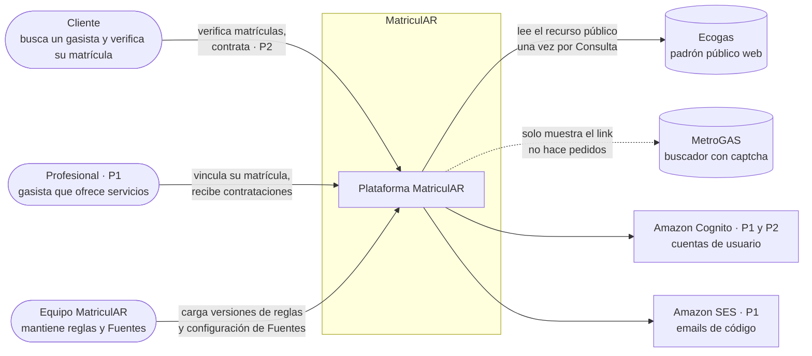
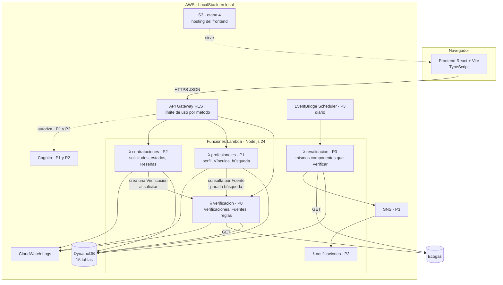
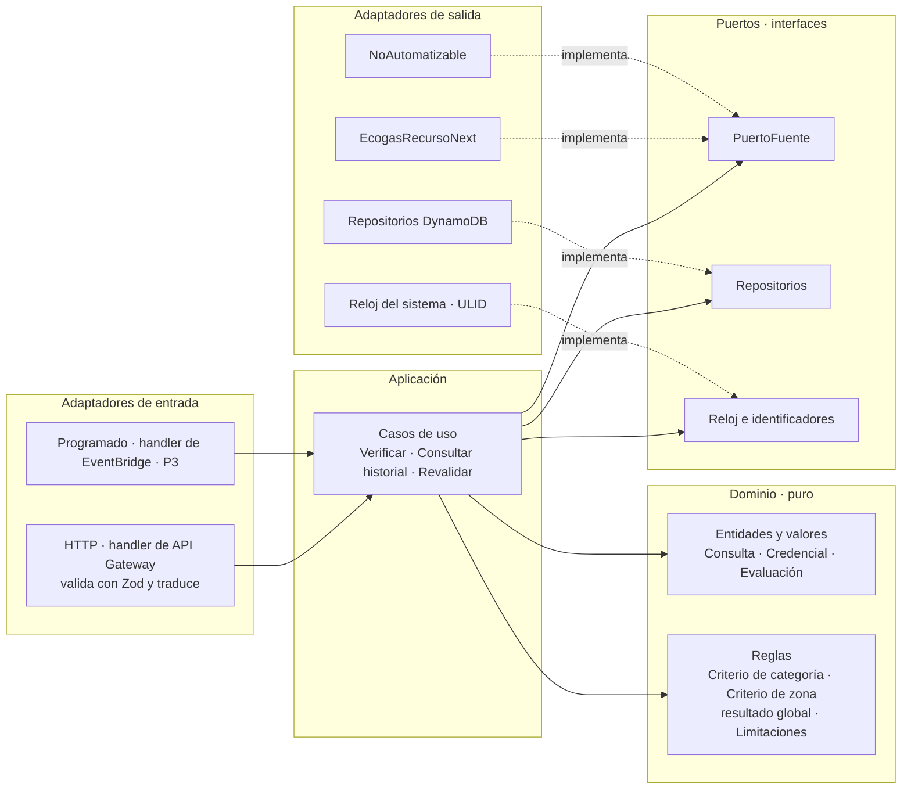

# Arquitectura

> Documento de diseño · Segunda entrega · Última revisión: 26/09/2026
> Cumple el ítem "Arquitectura del proyecto" de la consigna: descripción de la arquitectura elegida, tecnologías definitivas y justificación de las decisiones técnicas.
> Relacionados: [módulos](modulos.md) · [API](api.md) · [base de datos](../database/README.md) · [fuentes y adaptadores](fuentes-y-adaptadores.md) · [ADRs](adr/)

## Índice

1. [Resumen](#1-resumen)
2. [Contexto: quién usa el sistema y con qué se integra](#2-contexto-quién-usa-el-sistema-y-con-qué-se-integra)
3. [Contenedores: las piezas que se despliegan](#3-contenedores-las-piezas-que-se-despliegan)
4. [Estructura interna: capas y puertos](#4-estructura-interna-capas-y-puertos)
5. [Tecnologías definitivas y justificación](#5-tecnologías-definitivas-y-justificación)
6. [Decisiones de la primera entrega: qué sigue y qué cambió](#6-decisiones-de-la-primera-entrega-qué-sigue-y-qué-cambió)
7. [Entornos y costos](#7-entornos-y-costos)
8. [Seguridad y privacidad](#8-seguridad-y-privacidad)
9. [Garantías operativas](#9-garantías-operativas)
10. [Observabilidad](#10-observabilidad)
11. [Estrategia de pruebas](#11-estrategia-de-pruebas)
12. [Riesgos](#12-riesgos)
13. [Pendientes para el inicio de la implementación](#13-pendientes-para-el-inicio-de-la-implementación)

---

## 1. Resumen

| Aspecto | Decisión |
|---|---|
| **Estilo** | **Serverless en AWS**, organizado como **monolito modular por contexto**: una función Lambda por contexto de negocio (verificación, profesionales, contrataciones) y no una por endpoint. |
| **Estructura interna de cada función** | **Arquitectura hexagonal** (puertos y adaptadores): un dominio puro en el centro, casos de uso alrededor, y adaptadores para HTTP, DynamoDB y cada Fuente. |
| **Comunicación** | **Sincrónica** (pedido → respuesta) a través de API Gateway. **Sin colas ni DLQ** hasta que haya una necesidad concreta ([ADR-0001](adr/0001-sin-colas-reintentos-sincronicos.md)). |
| **Persistencia** | **DynamoDB**, con una tabla por entidad ([ADR-0004](adr/0004-una-tabla-dynamodb-por-entidad.md)). |
| **Lenguaje** | **TypeScript 7** en backend y frontend. En runtime corre **Node.js 24** (`nodejs24.x` en Lambda). |
| **Entornos** | **Local:** LocalStack (AWS emulado) con Docker. **Nube (etapa 4):** AWS real, con el mismo código de infraestructura. |
| **Infraestructura** | **100 % como código** con Terraform (D6). |

¿Por qué esta forma y no otra?

- **Serverless** porque el uso es intermitente (consultas puntuales, un proceso programado por día en P3): no se paga ni se mantiene un servidor ocioso. Además, aprender arquitectura cloud es un objetivo explícito del equipo desde la primera entrega (D1).
- **Monolito modular por contexto, no microservicios:** tres funciones con límites claros alcanzan. Una función por endpoint multiplicaría las piezas sin beneficio (D2).
- **Hexagonal** porque el núcleo del sistema (evaluar evidencia contra reglas) tiene que poder probarse **sin AWS y sin Ecogas**, y porque cada Fuente se integra con un adaptador distinto. Integrar un padrón nuevo es escribir un adaptador, no tocar el dominio (espíritu de la D4).
- **Sincrónico y sin colas**, porque el tutor lo pidió explícitamente: *primero el mecanismo más simple que permita registrar, detectar, reintentar, conservar e informar*. Las condiciones que justificarían colas están escritas en el ADR-0001.

---

## 2. Contexto: quién usa el sistema y con qué se integra

| Actor o sistema | Rol | Módulo |
|---|---|---|
| **Cliente** | Persona que necesita un gasista. En el P0 consulta sin cuenta; en P2 tiene cuenta para contratar. | P0, P2 |
| **Profesional** | Gasista que se registra, vincula su matrícula y ofrece servicios. | P1 |
| **Equipo MatriculAR** | Mantiene los datos de configuración (Fuentes, Tipos de trabajo) mediante archivos versionados. No hay back-office (fuera de alcance). | P0 |
| **Ecogas** | Fuente automatizable. MatriculAR descarga su recurso público en cada Consulta. | P0 |
| **MetroGAS** | Fuente no automatizable. MatriculAR **no le hace pedidos**: solo le muestra al Cliente el link a su buscador. | P0 |
| **Amazon Cognito** | Autenticación de Clientes y Profesionales. | P1 y P2 |
| **Amazon SES** | Envío del código de verificación del Vínculo al email que publica la Fuente. | P1 |

---

## 3. Contenedores: las piezas que se despliegan

| Contenedor | Responsabilidad | Módulo | Detalle |
|---|---|---|---|
| **Frontend** | Pantalla de verificación (P0), perfil del Profesional y búsqueda (P1), contratación (P2). | P0 a P2 | [`frontend/README.md`](../frontend/README.md) |
| **API Gateway (REST)** | Único punto de entrada. Enruta por prefijo a cada función, aplica límites de uso y, desde P1, autoriza con Cognito. Se usa REST (v1) porque está disponible en todos los planes de LocalStack y permite ampliar el timeout de 29 s. | P0 | [`api.md`](api.md) |
| **λ verificacion** | Casos de uso *Verificar*, *Consultar historial*, *Listar Fuentes, Tipos de trabajo y Categorías*. Contiene los adaptadores de Fuentes. | P0 | [`backend/verificacion/`](../backend/verificacion/) |
| **λ profesionales** | Perfil, Vínculos (código por email), zonas de trabajo y búsqueda. | P1 | [`backend/profesionales/`](../backend/profesionales/) |
| **λ contrataciones** | Contrataciones, transiciones de estado y Reseñas. | P2 | [`backend/contrataciones/`](../backend/contrataciones/) |
| **λ revalidacion** | Todos los días, una Consulta por Fuente para todas las matrículas vinculadas. Caso de uso *Revalidar*, armado con **los mismos componentes del núcleo** que *Verificar* (el espíritu de la D3). | P3 | [`backend/revalidacion/`](../backend/revalidacion/) |
| **λ notificaciones** | Avisa cuando una revalidación cambia el Resultado de verificación de un Profesional. | P3 | [`backend/notificaciones/`](../backend/notificaciones/) |
| **DynamoDB** | 15 tablas. | P0 a P2 | [`database/README.md`](../database/README.md) |

**Cómo se comunican las funciones entre sí.** Las funciones de P1 y P2 **no llaman por HTTP** a la de verificación: el caso de uso *Verificar* vive en un paquete compartido del backend ([`backend/compartido/`](../backend/compartido/)) y cada función lo incluye al empaquetarse. Así hay una sola implementación de las reglas, sin llamadas de red internas. Las flechas del diagrama muestran la dependencia lógica.

---

## 4. Estructura interna: capas y puertos

Cada función sigue la misma estructura. La **regla de dependencias** es que las flechas apuntan siempre hacia el dominio. El dominio no conoce AWS, HTTP ni Ecogas.

| Capa | Contiene | No puede |
|---|---|---|
| **Dominio** | Tipos del glosario (`Credencial`, `Evaluacion`, resultados enumerados), el cálculo de Criterios y del resultado global, y el armado de Limitaciones. Funciones puras. | Importar el SDK de AWS, hacer I/O o leer la hora del sistema. |
| **Aplicación** | Casos de uso que orquestan: registrar la Consulta, leer la Fuente, persistir en una transacción y responder. | Conocer detalles de HTTP o de DynamoDB. |
| **Puertos** | Interfaces que la aplicación necesita: `PuertoFuente`, repositorios, reloj e identificadores. | — |
| **Adaptadores** | Implementaciones concretas: handler HTTP, adaptadores de Fuentes, repositorios DynamoDB. | Tomar decisiones del dominio. |

Ventajas concretas para este proyecto:

- **El dominio se prueba sin nada externo**, con pruebas unitarias rápidas de los escenarios S1 a S10.
- **Los adaptadores de Fuentes se prueban con fixtures**, sin depender de que Ecogas esté disponible.
- **Cambiar de base o de nube** solo toca los adaptadores (principio "Diseñado para migrar").

---

## 5. Tecnologías definitivas y justificación

La lectura U1-A2 de la cátedra propone justificar el stack respondiendo cinco preguntas. Las respuestas:

| Pregunta | Respuesta |
|---|---|
| ¿Por qué este lenguaje y framework para el **frontend**? | **React + Vite + TypeScript.** El frontend del P0 es una pantalla con un formulario y un resultado rico (Criterios, evidencia y Limitaciones). React ya estaba declarado en la primera entrega, tiene el ecosistema más amplio de componentes y documentación, y Vite da un entorno de desarrollo rápido con transpilación incluida. |
| ¿Por qué este lenguaje y framework para el **backend**? | **TypeScript sobre Node.js 24, sin framework web** (los handlers de Lambda son funciones). Usamos el **mismo lenguaje en frontend y backend**, que es el escenario que la lectura asigna a JavaScript/TypeScript ("cuando se requiere unificación de lenguaje"). Esto permite **compartir los tipos del dominio y los esquemas Zod** entre la API y la interfaz. El dominio es una colección de estados enumerados y reglas, donde un error de tipos es un error de interpretación: el tipado estático los detecta al compilar. |
| ¿Por qué este **gestor de base de datos**? ¿SQL o NoSQL? | **DynamoDB (NoSQL, clave-valor y documentos).** Los patrones de acceso son pocos y conocidos, la evidencia es inmutable y se lee por clave y fecha, sin *joins*, y es la base nativa del modelo serverless. Ver [database § 2](../database/README.md#2-por-qué-dynamodb-y-por-qué-una-tabla-por-entidad). |
| ¿Por qué esta **plataforma de despliegue**? ¿Qué restricciones influyeron? | **AWS serverless (Lambda + API Gateway + DynamoDB), desarrollado sobre LocalStack.** Restricciones: aprender arquitectura cloud sin riesgo de facturación durante el desarrollo, uso intermitente y la etapa 4 de la hoja de ruta, que exige un servicio en la nube. |
| ¿El equipo tiene **experiencia previa** con estas tecnologías? | **Sí.** Iván tiene experiencia en todas las partes del stack: TypeScript, React, AWS serverless (Lambda, API Gateway, DynamoDB) y Terraform. Esto cumple una de las condiciones que la lectura plantea para adoptar tecnologías: *"se cuenta con algún integrante del equipo que ya domina la tecnología y puede guiar al resto"*. La novedad real es el compilador de TypeScript 7; el riesgo se acota porque el lenguaje no cambia y se mitiga con las herramientas elegidas ([§ 12](#12-riesgos)). |

### 5.1 Tabla de tecnologías

| Capa | Tecnología | Versión | Para qué | Alternativa descartada y por qué |
|---|---|---|---|---|
| Lenguaje | **TypeScript** | **7.0** (compilador nativo en Go, estable desde el 08/07/2026) | Tipado estático en todo el proyecto. `tsc --noEmit` para chequear tipos, con `--build` en paralelo. | **TypeScript 6.x**: funciona, pero el compilador de la 7 es mucho más rápido y es la versión vigente. **Python** (el de la investigación): dos lenguajes en el proyecto y no permite compartir tipos con el frontend. |
| Runtime | **Node.js 24** (`nodejs24.x` en Lambda) | 24 LTS | Ejecutar las funciones. | `nodejs22.x`: se depreca en abril de 2027, dentro de la vida del proyecto. `nodejs26.x`: todavía en preview, sin SLA. |
| Empaquetado del backend | **esbuild** | la estable al iniciar | Un paquete por función, con el AWS SDK v3 incluido (lo recomienda AWS: el runtime trae una versión fija del SDK). | Empaquetar solo con `tsc`: no genera un bundle por función. |
| Frontend | **React + Vite** | Vite 8 | SPA de la interfaz. | Plantillas del lado del servidor: el backend serverless no sirve HTML. |
| Validación | **Zod** | la estable al iniciar | Validar los pedidos de la API, los registros de la Fuente (validación V4) y los ítems antes de escribirlos. Los esquemas se comparten con el frontend. | Validación manual: se duplica y diverge. |
| Pruebas | **Vitest** | 5.x | Pruebas unitarias y de integración. | Jest: más lento y con configuración extra para TypeScript y ESM. |
| Lint y formato | **Biome** | la estable al iniciar | Lint y formato en una sola herramienta que **no depende de la API de TypeScript**. | ESLint + typescript-eslint: **no funciona con TS 7.0**, porque requiere la API programática que llega en la 7.1. Habría que instalar TS 6 en paralelo como alias. |
| Base de datos | **DynamoDB** | — | Persistencia. | PostgreSQL: requiere un servidor (o RDS), rompe el modelo serverless y no está en el plan original. |
| API | **API Gateway REST (v1)** | — | Entrada HTTP, límites de uso y autorización. | HTTP API (v2): no está disponible en el plan Hobby de LocalStack. |
| Autenticación | **Amazon Cognito** | — | Cuentas de Clientes y Profesionales (P1 y P2). | Autenticación propia con JWT: implica guardar contraseñas y es un riesgo de seguridad innecesario. |
| Email | **Amazon SES** | — | Código de verificación del Vínculo (P1). | — (a validar, ver [§ 13](#13-pendientes-para-el-inicio-de-la-implementación)). |
| Programación de tareas | **EventBridge Scheduler** | — | Revalidación diaria (P3). | Cron en un servidor: no hay servidor. |
| Notificaciones | **SNS** | — | Fan-out de avisos (P3). | — |
| Infraestructura | **Terraform** | 1.x | Todos los recursos como código (D6). En local se ejecuta con **`lstk terraform`**, que reemplaza al `tflocal` deprecado. | AWS CDK o SAM: Terraform ya estaba declarado y es agnóstico de proveedor. |
| Entorno local | **LocalStack** (plan Student, o Hobby si la verificación demora) + **Docker** | calver 2026.x | AWS emulado para desarrollar sin costo. | Desarrollar directo contra AWS: riesgo de facturación y ciclo más lento. |
| Nube | **AWS** (Free plan) | — | Despliegue de la etapa 4. | PaaS (Render, Railway): no ejercita la arquitectura serverless que es objetivo del proyecto. |

---

## 6. Decisiones de la primera entrega: qué sigue y qué cambió

| # | Decisión original | Estado | Qué cambió y por qué |
|---|---|---|---|
| **D1** | Entorno local con LocalStack, "sin cuenta de AWS, sin tarjeta y sin riesgo de facturación". | **Revisada** | Desde el 23/03/2026, LocalStack exige **cuenta y token** (se terminó la Community edition). Nueva formulación: *LocalStack con cuenta gratuita (plan Student u Hobby), sin tarjeta y sin riesgo de facturación durante el desarrollo; despliegue en AWS real en la etapa 4, con el mismo Terraform.* El diseño funciona también con el plan Hobby: usa API Gateway REST, no depende de la persistencia de LocalStack y recrea los datos con Terraform y el seed. |
| **D2** | Serverless puro, con Lambdas por contexto. | **Vigente** | Los contextos son verificación, profesionales y contrataciones, más revalidación y notificaciones en P3. |
| **D3** | Un único pipeline de verificación (SQS + DLQ) con dos disparadores (evento de S3 y scheduler). | **Revisada** → [ADR-0001](adr/0001-sin-colas-reintentos-sincronicos.md) | Se mantiene la idea de **un solo camino con dos disparadores**: el pedido HTTP y el scheduler de P3 usan los mismos componentes del núcleo (lectura de la Fuente, registro de la Consulta y de los Resultados). Se eliminan SQS, la DLQ y el evento de S3. |
| **D4** | Padrones simulados detrás de una interfaz, con un mock configurable. | **Revisada** | Se mantiene el **puerto de Fuentes**, pero los adaptadores son **reales**: Ecogas (automatizable) y MetroGAS (no automatizable). Las simulaciones quedan solo en los tests (INV-12). |
| **D5** | DynamoDB como almacenamiento. | **Vigente**, con [ADR-0004](adr/0004-una-tabla-dynamodb-por-entidad.md) | Una tabla por entidad. |
| **D6** | Infraestructura 100 % como código con Terraform. | **Vigente** | En local se usa `lstk terraform` en lugar de `tflocal`, que está deprecado. |

Decisiones nuevas de esta entrega: [ADR-0001](adr/0001-sin-colas-reintentos-sincronicos.md) (sin colas), [ADR-0002](adr/0002-consulta-bajo-demanda-sin-copia-del-padron.md) (consulta bajo demanda), [ADR-0003](adr/0003-credencial-separada-de-evaluacion-sin-afirmar-vigencia.md) (Credencial separada de Evaluación y vigencia no afirmada) y [ADR-0004](adr/0004-una-tabla-dynamodb-por-entidad.md) (una tabla por entidad).

---

## 7. Entornos y costos

| Entorno | Para qué | Cómo se levanta | Costo |
|---|---|---|---|
| **Local** | Desarrollo y pruebas de integración. | Docker + LocalStack (con `LOCALSTACK_AUTH_TOKEN` en `.env`, que está ignorado por git) → `lstk terraform apply` (tablas, funciones, API) → script de seed → `npm run dev` del frontend apuntando a la URL de la API en LocalStack. **Todo se destruye y se recrea con un comando** (D6). | USD 0. |
| **Nube** (etapa 4, del 28/09 al 21/11) | Servicio público para la entrega final, el video y la defensa. | Cuenta de AWS con **Free plan**, el **mismo Terraform** con el proveedor apuntando a AWS, y el frontend servido desde S3. | Lambda y DynamoDB entran en el uso gratuito o cuestan centavos con este volumen. API Gateway **no** es gratuito para cuentas nuevas y consume de los créditos (USD 100 a 200). **Alerta de presupuesto de USD 5 desde el primer día.** |

Cosas a tener en cuenta sobre la cuenta de AWS:

- El Free plan dura **6 meses o hasta agotar los créditos**. Después la cuenta se cierra y hay 90 días para pasarla a Paid. Si la defensa en mesa de examen fuera después de ese plazo, hay que **pasar a Paid plan** (los créditos se mantienen) o volver a desplegar.
- La cuenta la crea **uno de los integrantes**, con su tarjeta, y comparte el acceso con el otro mediante usuarios de IAM.
- Riesgo propio de la nube: la detección de bots de Ecogas podría bloquear los pedidos desde IPs de AWS ([fuentes § 9, P-2](fuentes-y-adaptadores.md#9-puntos-pendientes)).

---

## 8. Seguridad y privacidad

| Tema | Medida |
|---|---|
| **Permisos (IAM)** | Mínimo privilegio **por función**. Ninguna función tiene `DeleteItem` sobre las tablas de evidencia (`Consultas`, `ResultadosVerificacion`, `Credenciales`, `Evaluaciones`, `Verificaciones`), ni `UpdateItem` sobre ninguna de ellas **salvo `Consultas`**, que se actualiza una sola vez para finalizarla. Esto **refuerza** la inmutabilidad (INV-1) impidiendo actualizaciones y borrados. La garantía principal la dan las escrituras condicionales `attribute_not_exists`, porque IAM no puede exigir la condición de un `PutItem`. |
| **Validación de entradas** | Todo pedido se valida con Zod en el handler antes de llegar al caso de uso. Las matrículas se normalizan y se limita su largo. |
| **Límite de uso** | Throttling de API Gateway en `POST /verificaciones` (valor inicial: 2 pedidos por segundo con ráfagas de 5, configurable). Protege tanto a MatriculAR como a la Fuente: cada Verificación implica una descarga. |
| **CORS** | Solo se admite el origen del frontend. |
| **Datos personales** | Minimización: nunca se persisten el email, el teléfono ni el barrio de la Fuente, ni el padrón, ni el cuerpo de las respuestas HTTP. Ver [database § 11](../database/README.md#11-datos-personales-qué-se-guarda-y-qué-no). |
| **Autenticación (P1 y P2)** | Cognito: MatriculAR no guarda contraseñas. API Gateway valida el token antes de invocar las funciones de P1 y P2. |
| **Vínculo (P1)** | El código se guarda **solo como hash**, vence y tiene un límite de intentos. El email de la Fuente se usa en memoria. |
| **Secretos** | El P0 no tiene secretos de aplicación. El token de LocalStack y las credenciales de AWS viven en `.env` o en el perfil local, nunca en el repositorio. |
| **Fuentes** | No se evita ninguna protección (captcha, bloqueo por 403). La identificación del adaptador ante Ecogas queda pendiente de su respuesta sobre las condiciones de uso ([P-1](fuentes-y-adaptadores.md#9-puntos-pendientes)). |
| **Repositorio público** | Los archivos actuales no tienen datos personales reales: los ejemplos son ficticios y la investigación fue anonimizada. **El historial de git conserva la versión anterior** de la investigación (commit `5afe305`). **El historial se va a reescribir después de la aprobación del tutor**, coordinado entre los dos integrantes, para no alterar antes de la revisión commits que el tutor ya vio. |

---

## 9. Garantías operativas

Estas garantías reemplazan a las de la primera entrega, que suponían un pipeline con colas.

| Garantía | Cómo se cumple |
|---|---|
| **Cada intento queda registrado** | La Consulta se crea en `IN_PROGRESS` **antes** del primer pedido, y cada Intento guarda sus pedidos HTTP. Si la función se corta, la Consulta queda como evidencia de un intento interrumpido. |
| **Detección del error** | Las cinco validaciones del adaptador y la clasificación de fallas ([fuentes § 4.3 y § 4.5](fuentes-y-adaptadores.md#43-las-cinco-validaciones)). |
| **Reintento** | Hasta 3 Intentos, solo ante fallas transitorias, dentro de un presupuesto de 24 s. |
| **Se conserva el estado del fallo** | Consulta `FAILED` con motivo y detalle. La evidencia anterior no se toca. |
| **Se informa** | Resultado `UNVERIFIABLE` en la respuesta, con el motivo, y endpoint de salud de la Fuente (`GET /fuentes/{fuente_id}/consultas`). |
| **Evidencia inmutable** | Escrituras condicionales `attribute_not_exists` (la garantía), reforzadas por permisos de IAM sin `DeleteItem` y sin `UpdateItem` sobre la evidencia, salvo la finalización de la Consulta. |
| **Idempotencia** | Las escrituras condicionales hacen que repetir un paso no pise datos. Un reintento del Cliente crea una Verificación nueva, lo cual es correcto: es otra pregunta en otro momento. |
| **Sin estados intermedios** | La finalización de una Verificación es una única transacción `TransactWriteItems`. |
| **Máquinas de estado explícitas** | La Consulta y la Contratación tienen estados y transiciones definidos ([modelo § 7](modelo-de-dominio.md#7-estados)). Las transiciones de la Contratación se escriben de forma condicional. |

---

## 10. Observabilidad

- **Logs estructurados** en JSON hacia CloudWatch Logs, con `verificacion_id` y `consulta_id` en cada línea, para seguir un pedido de punta a punta.
- **Salud de la Fuente:** la tabla `Consultas` (índice `por-fuente`) ya registra cada lectura con su resultado. El endpoint `GET /fuentes/{fuente_id}/consultas` muestra las últimas, con estado, motivo, cantidad de registros y huella del recurso. Un cambio de huella indica que Ecogas actualizó el padrón, y una racha de `EXTRACTION_FAILED` indica que cambió la estructura.
- **Alertas** (etapa 4): una alarma de CloudWatch si la proporción de Consultas `FAILED` supera un umbral en una hora.

---

## 11. Estrategia de pruebas

| Nivel | Qué se prueba | Herramienta | Depende de |
|---|---|---|---|
| **Unitarias de dominio** | Criterios, resultado global y Limitaciones. Los escenarios S1 a S10 del [modelo](modelo-de-dominio.md#9-escenarios) se convierten en casos de prueba. | Vitest | Nada |
| **Adaptadores de Fuentes** | Las 14 fixtures (F1 a F14) de [fuentes § 6](fuentes-y-adaptadores.md#6-cómo-se-prueba): descubrimiento, validaciones, reintentos y que no se filtren datos de contacto. | Vitest con servidor HTTP falso | Nada |
| **Repositorios** | Escrituras condicionales, transacción de finalización e índices. | Vitest + DynamoDB en LocalStack | LocalStack |
| **API (integración)** | Contrato de cada endpoint: formas de respuesta validadas con los mismos esquemas Zod que usa el frontend. | Vitest + API Gateway en LocalStack | LocalStack |
| **Humo contra la Fuente real** | Que el adaptador siga funcionando contra Ecogas. **Manual y opcional**, nunca en cada ejecución. | Script | Ecogas |

Se desarrolla con TDD (primero la prueba y después el código), empezando por el dominio.

---

## 12. Riesgos

| Riesgo | Prob. | Impacto | Mitigación |
|---|---|---|---|
| Ecogas cambia la estructura o la URL del recurso | **Alta** (ya pasó entre el 04/09 y el 26/09) | Medio | Descubrimiento de la URL, cinco validaciones y resultado `UNVERIFIABLE` en lugar de un falso negativo. Salud de la Fuente visible. |
| Ecogas restringe el acceso automatizado o bloquea las IPs de AWS | Media | Alto | Consulta sobre condiciones de uso. Si pasa, la Consulta da `SOURCE_UNAVAILABLE` y el sistema sigue siendo coherente. El puerto permite reemplazar la Fuente. |
| Cambios normativos (NAG-200 y NAG-225 en revisión) | Media | Medio | Reglas versionadas como datos y Evaluaciones con copia de la regla aplicada. |
| Interpretación incorrecta de una regla | Media | Alto | Toda regla con cita, revisión cruzada entre los integrantes y resultado `INDETERMINATE` cuando no hay respaldo. |
| Licencia de LocalStack (ahora requiere cuenta) | Baja (ya mitigado) | Medio | Diseño compatible con el plan Hobby. Se tramita el plan Student. |
| Ecosistema de TypeScript 7 todavía inmaduro (herramientas que dependen de su API) | Media | Bajo | Biome en lugar de typescript-eslint. Si una herramienta crítica falla, se puede usar TS 6 como alias para esa herramienta. |
| Costos en AWS real | Baja | Medio | Free plan, alerta de presupuesto de USD 5 y DynamoDB bajo demanda. |
| Vencimiento del Free plan antes de la defensa | Media | Medio | Pasar a Paid plan (se conservan los créditos) o redesplegar con Terraform. |
| SES en *sandbox* solo envía a direcciones verificadas (P1) | Alta | Medio | Pedir acceso de producción a SES al empezar P1. Mientras tanto, se demuestra con direcciones verificadas. |
| Alcance: 4 niveles de prioridad en unas 7 semanas | **Alta** | Alto | P0 primero y completo. P1 a P3 se recortan en ese orden. Backlog congelado ([módulos](modulos.md)). |
| Datos personales expuestos en el repositorio público | Media (mitigado en los archivos actuales, no en el historial) | Alto | Anonimización, ejemplos ficticios y `.gitignore` para las muestras. Reescritura del historial de git después de la aprobación del tutor. |

---

## 13. Pendientes para el inicio de la implementación

| # | Pendiente | Cuándo se resuelve |
|---|---|---|
| A-1 | Identificación del adaptador ante Ecogas (`User-Agent`), según su respuesta ([P-1](fuentes-y-adaptadores.md#9-puntos-pendientes)). | Antes de implementar el adaptador. |
| A-2 | Versiones exactas de Zod, Biome, esbuild y React. | Al iniciar la implementación: se fijan en `package.json`. |
| A-3 | Integración continua: se propone GitHub Actions con lint, chequeo de tipos y pruebas unitarias. Las pruebas con LocalStack requieren guardar el token como secreto. | Al iniciar la implementación. |
| A-4 | HTTPS para el frontend en la nube: S3 solo sirve HTTP, así que haría falta CloudFront o una alternativa. | Etapa 4. |
| A-5 | Disponibilidad de SES en el plan de LocalStack que se use. | Al empezar P1. |
