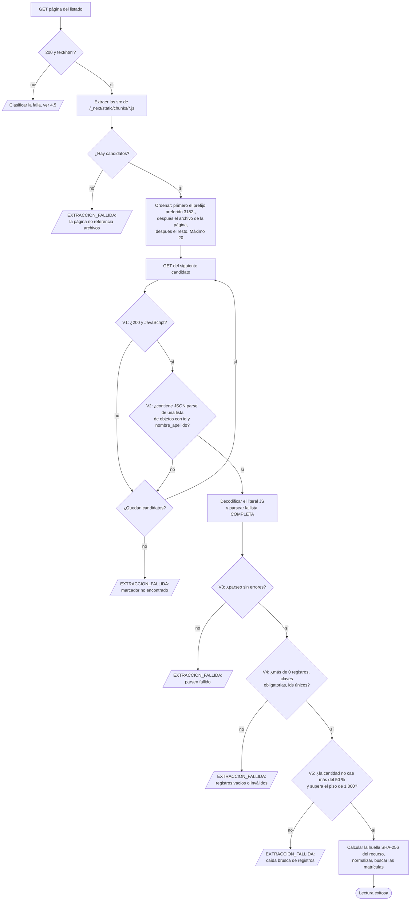

# Fuentes y adaptadores

> Documento de diseño · Segunda entrega · Última revisión: 26/09/2026
> Responde a los puntos 4 ("adaptador Ecogas integrado al backend"), 5 ("persistencia de fuente, fecha y resultado de consulta") y 7 ("manejo controlado del fallo de extracción") de la devolución v2, **a nivel de diseño**. La implementación empieza cuando se apruebe esta entrega.
> Vocabulario: [`CONTEXT.md`](../CONTEXT.md). Modelo: [`modelo-de-dominio.md`](modelo-de-dominio.md). Decisiones: [ADR-0001](adr/0001-sin-colas-reintentos-sincronicos.md), [ADR-0002](adr/0002-consulta-bajo-demanda-sin-copia-del-padron.md).

## Índice

1. [Qué problema resuelve un adaptador](#1-qué-problema-resuelve-un-adaptador)
2. [El puerto de Fuentes](#2-el-puerto-de-fuentes)
3. [Fuentes del P0](#3-fuentes-del-p0)
4. [Adaptador de Ecogas](#4-adaptador-de-ecogas)
5. [Adaptador de MetroGAS (no automatizable)](#5-adaptador-de-metrogas-no-automatizable)
6. [Cómo se prueba](#6-cómo-se-prueba)
7. [Cómo se agrega una Fuente nueva](#7-cómo-se-agrega-una-fuente-nueva)
8. [Uso responsable de las Fuentes](#8-uso-responsable-de-las-fuentes)
9. [Puntos pendientes](#9-puntos-pendientes)

---

## 1. Qué problema resuelve un adaptador

Cada Distribuidora publica su padrón de una manera distinta. La investigación encontró:

- un archivo JavaScript estático que hay que descubrir (Ecogas);
- una API protegida con captcha (MetroGAS);
- un listado HTML paginado por partido (Naturgy BAN, sin evaluar todavía).

Esas fuentes **no tienen contrato**: pueden cambiar de URL, de formato o de orden de campos en cualquier momento.

El adaptador **aísla** esa variabilidad. El resto del sistema (Consultas, Credenciales, Evaluaciones) no sabe cómo está hecho el sitio de cada Distribuidora. Solo recibe una de dos respuestas:

- **Lectura exitosa:** los registros normalizados de las matrículas buscadas, más los metadatos de la lectura.
- **Lectura fallida:** un motivo (`FUENTE_NO_DISPONIBLE` o `EXTRACCION_FALLIDA`) y el detalle de cada Intento.

**Responsabilidad central** (devolución v2): *si la Fuente cambia su URL, el orden de los campos o la estructura del recurso, MatriculAR no debe interpretar "se encontraron cero matriculados". Debe producir FUENTE NO CONSULTABLE o EXTRACCIÓN FALLIDA.*

---

## 2. El puerto de Fuentes

El núcleo define **una interfaz** (el *puerto*) y cada mecanismo de publicación tiene **un adaptador** que la implementa. La decisión D4 de la primera entrega se mantiene en su espíritu ("integrar un padrón nuevo es escribir un adaptador, no tocar el pipeline"), pero ahora los adaptadores son **reales**.

| Operación del puerto | Entrada | Salida | Quién la usa |
|---|---|---|---|
| `leer` | Versión de la configuración de la Fuente y lista de matrículas buscadas | **Lectura exitosa:** para cada matrícula buscada, el registro normalizado o "no figura", más los metadatos (URL resuelta, huella del recurso, cantidad de registros, resumen, Intentos). **Lectura fallida:** motivo, detalle e Intentos. **No realizada:** la Fuente no es automatizable. | Caso de uso *Verificar* (P0), *Revalidar* (P3), *Buscar* (P1) |
| `obtenerContactoParaVinculo` | Configuración de la Fuente y **una** matrícula | El email que publica la Fuente para esa matrícula, **en memoria y sin persistir**, o "sin email". | Caso de uso *Verificar Vínculo* (P1) |

| Adaptador | Mecanismo | Fuentes que lo usan |
|---|---|---|
| `EcogasRecursoNext` | Página HTML → archivo JavaScript de Next.js → lista JSON embebida | `ecogas` |
| `NoAutomatizable` | No hace ningún pedido; siempre responde "no realizada". | `metrogas` |

Reglas del puerto:

1. **El adaptador nunca devuelve datos de contacto** en `leer`. Email, teléfono y barrio se descartan dentro del adaptador (INV-9).
2. **El adaptador no decide nada del dominio.** No evalúa categorías ni zonas: solo lee, valida y normaliza.
3. **El adaptador no escribe en la base.** Devuelve los Intentos y los metadatos, y es el caso de uso el que los persiste en la Consulta.
4. **Un resultado vacío nunca es "éxito sin registros".** Si no hay registros, es `EXTRACCION_FALLIDA` (INV-4).

---

## 3. Fuentes del P0

La configuración de cada Fuente es un **dato versionado** (tabla `Fuentes`, cargada desde [`database/seed/fuentes.json`](../database/seed/fuentes.json)). Cambiar un parámetro, como el umbral o los tiempos, no requiere tocar código.

| Parámetro | `ecogas` | `metrogas` |
|---|---|---|
| Distribuidora | Ecogas (Distribuidora de Gas del Centro y Distribuidora de Gas Cuyana) | MetroGAS |
| Área de concesión | Córdoba, Catamarca, La Rioja, Mendoza, San Juan, San Luis | CABA y parte del conurbano (no interviene en Evaluaciones) |
| Modo de acceso | `AUTOMATICA` | `NO_AUTOMATIZABLE` |
| Adaptador | `EcogasRecursoNext` | `NoAutomatizable` |
| URL de la página | `https://www.ecogas.com.ar/hogares-comercios/tramites-y-servicios/listado-de-gasistas-matriculados` | — |
| URL del buscador oficial (para el Cliente) | la misma | `https://www.metrogas.com.ar/colaboradores/listado-de-gasistas-con-matricula/` |
| Prefijo de archivo preferido | `3182-` | — |
| Claves obligatorias del registro | `id`, `nombre_apellido`, `categoria`, `provincia`, `localidad` | — |
| Claves conocidas (se leen y se descartan) | `correo_electronico`, `telefono`, `barrio` | — |
| Máximo de Intentos | 3 | — |
| Esperas entre Intentos | 1 s y 2 s | — |
| Tiempo máximo por pedido HTTP | 6 s | — |
| Tiempo máximo de la Consulta | 24 s | — |
| Umbral de caída de registros | 50 % | — |
| Piso absoluto de registros | 1.000 | — |
| Limitaciones que agrega | Vigencia no informada; provincia informada = domicilio; fuente web no contractual | Fuente no consultable automáticamente (captcha) |

---

## 4. Adaptador de Ecogas

### 4.1 Qué sabemos del recurso

Relevamiento del **26/09/2026**, hecho con pedidos mínimos, sin guardar datos personales:

| Hecho | Detalle |
|---|---|
| Tipo de sitio | Next.js con App Router (`self.__next_f`). No tiene `__NEXT_DATA__`, `buildId` ni `_buildManifest.js`. |
| Página del listado | Responde 200 (unos 70 KB) y referencia **17 scripts** `/_next/static/chunks/*.js` en etiquetas `<script src>`. |
| Archivo del padrón | Referenciado **directamente** en el HTML. El 26/09/2026 era `3182-5194f519f6f9f5b0.js` (200, `application/javascript`, unos 1,1 MB). |
| URL de la prueba técnica | `3182-ad3160686a0b7005.js` → **404**, con una página HTML de 12 KB. **Una validación que solo mirara el código de estado no alcanza:** hay que chequear también el tipo de contenido. |
| Forma de los datos | Un módulo de webpack con `JSON.parse('[{"id":…}]')`: la lista completa como literal de string de JavaScript, con escapes `\xNN` (tildes y Ñ), `\\` y `\'`. |
| Marcador engañoso | El archivo de la página (`page-*.js`) también contiene `"nombre_apellido"`, pero como **definición de columnas** de la tabla. Buscar esa palabra suelta no alcanza para identificar el recurso. |
| Registros | **5.031**, todos con las mismas 8 claves (todas string): `id`, `nombre_apellido`, `categoria`, `provincia`, `localidad`, `barrio`, `correo_electronico`, `telefono`. 5.031 `id` únicos y numéricos. |
| Categorías | `"1"`: 1.641 · `"2"`: 2.235 · `"3"`: 1.155 |
| Provincias | Córdoba 3.263 · Mendoza 1.228 · San Luis 240 · San Juan 225 · Catamarca 38 · La Rioja 36 · Buenos Aires 1 |
| Fechas | **Ninguna**: ni en los registros, ni en el archivo, ni en la página. No hay encabezado `Last-Modified` (`cache-control: no-store`). |
| Evolución | El 04/09/2026 había 4.512 registros y otro nombre de archivo. En tres semanas cambiaron el nombre del archivo, el orden de las claves y la cantidad de registros. |

### 4.2 Algoritmo de lectura

Cada **Intento** ejecuta la secuencia completa:

Detalles:

- **Candidatos.** Se toman las URLs de las etiquetas `<script src>` que apuntan a `/_next/static/chunks/`, sin duplicados. El prefijo preferido (`3182-`) es solo una **optimización**: en el caso normal el recurso correcto se encuentra con **2 pedidos** (la página y el archivo). Si el prefijo cambia, el adaptador recorre los demás candidatos sin fallar.
- **Marcador.** Se busca el inicio de `JSON.parse('[{"id":"` y, dentro del literal, la clave `"nombre_apellido"`. El archivo de la página, que define columnas pero no contiene la lista, no cumple esa condición.
- **Decodificación.** Se toma el literal completo entre `JSON.parse('` y su `')` de cierre, respetando las comillas escapadas. Se decodifican los escapes de JavaScript (`\xNN`, `\uNNNN`, `\\`, `\'`) y se parsea **la lista entera**. No se parsea registro por registro: en la verificación del 26/09/2026, parsear cada fragmento por separado **perdía 342 registros** (los que tienen tildes o Ñ) sin que se produjera ningún error.
- **Búsqueda.** Con la lista validada se arma un índice por `id` y se resuelve cada matrícula buscada: el registro normalizado o "no figura". Las matrículas se comparan como texto, sin ceros a la izquierda y sin espacios.

### 4.3 Las cinco validaciones

Una lectura es exitosa **solo si pasan las cinco**. Si falla cualquiera, la Consulta es `FALLIDA` con motivo `EXTRACCION_FALLIDA`, y se guarda **cuál** validación falló y por qué.

| # | Validación | Qué evita | Evidencia real |
|---|---|---|---|
| **V1** | La respuesta es **200** y el tipo de contenido es **JavaScript**. | Tomar una página de error HTML como si fuera el recurso. | La URL de la prueba técnica devuelve 404 con cuerpo HTML. |
| **V2** | Aparece el **marcador** de la lista de registros. | Tomar un archivo equivocado, como el de la página, que menciona `nombre_apellido` pero no tiene datos. | El archivo de la página contiene `"nombre_apellido"` como columna. |
| **V3** | La lista **completa** se decodifica y se parsea sin errores. | Extracciones parciales silenciosas. | Parsear fragmento por fragmento perdía 342 registros. |
| **V4** | Hay **más de 0 registros**, todos tienen las **claves obligatorias**, los `id` son **únicos** y no vacíos. | "0 matriculados" y cambios de estructura, como una clave renombrada. | El patrón de la prueba técnica encontraba 0 registros porque cambió el orden de las claves. |
| **V5** | La cantidad **no cae más de un 50 %** respecto de la última Consulta exitosa de la Fuente y **supera el piso absoluto** de 1.000 registros (que aplica también en la primera Consulta). | Extracciones truncadas o un recurso reemplazado por otro más chico. | Entre el 04/09 y el 26/09 el padrón **creció** de 4.512 a 5.031; una caída a la mitad no es un comportamiento esperable. |

Controles adicionales, que **no hacen fallar** la lectura y quedan registrados en la Consulta:

- **Claves no esperadas:** si aparece una clave nueva (por ejemplo, un campo de vigencia), se registra en `claves_no_esperadas` para revisarla. Podría cambiar las reglas.
- **Resumen:** conteo de registros por categoría y por provincia. No contiene datos personales y permite detectar cambios de estructura.

### 4.4 Normalización

| Campo de la Fuente | Campo de la Credencial | Transformación |
|---|---|---|
| `id` | `matricula` | Texto, sin espacios ni ceros a la izquierda. |
| `nombre_apellido` | `nombre_informado` | Espacios colapsados y en mayúsculas. **Se guarda** para que el Cliente pueda confirmar que la matrícula pertenece a la persona que tiene enfrente. |
| `categoria` | `categoria_informada` | Texto tal como viene (`"1"`, `"2"`, `"3"`). **No se convierte a número** (INV-7). Si no está en el catálogo, el Criterio de categoría es `INDETERMINADO`. |
| `provincia` | `provincia_informada` | Mayúsculas, sin tildes, y se mapea al catálogo de provincias. Se muestra como "provincia informada por la Fuente". |
| `localidad` | `localidad_informada` | Mayúsculas, espacios colapsados. |
| `correo_electronico` | — | **Se descarta** en el adaptador. Solo `obtenerContactoParaVinculo` lo lee, en memoria (P1). |
| `telefono` | — | **Se descarta.** |
| `barrio` | — | **Se descarta.** |

### 4.5 Clasificación de fallas y reintentos

Mecanismo acordado con el tutor: **registrar el intento → detectar el error → reintentar → conservar el estado del fallo → informar**, sin colas ([ADR-0001](adr/0001-sin-colas-reintentos-sincronicos.md)).

| Situación | Motivo | ¿Se reintenta? | Por qué |
|---|---|---|---|
| Error de red, DNS o conexión rechazada | `FUENTE_NO_DISPONIBLE` | **Sí** | Transitorio. |
| Tiempo agotado de un pedido (más de 6 s) | `FUENTE_NO_DISPONIBLE` | **Sí** | Transitorio. |
| HTTP 5xx | `FUENTE_NO_DISPONIBLE` | **Sí** | Falla del servidor, usualmente transitoria. |
| HTTP 429 (demasiados pedidos) | `FUENTE_NO_DISPONIBLE` | **Sí**, respetando `Retry-After` si entra en el presupuesto de tiempo | Transitorio, pero indica que conviene espaciar. |
| HTTP 403 (bloqueo por detección de bots) | `FUENTE_NO_DISPONIBLE` | **No** | Reintentar insistiría contra una protección. |
| HTTP 404 o 410 de la página del listado | `EXTRACCION_FALLIDA` | **No** | La página cambió de dirección: es un cambio estructural. |
| No hay candidatos, o ninguno pasa V1 y V2 | `EXTRACCION_FALLIDA` | **No** | Cambio estructural: fallaría igual en cada Intento. |
| Falla V3, V4 o V5 | `EXTRACCION_FALLIDA` | **No** | Ídem. |
| Se agota el tiempo total de la Consulta (24 s) | `FUENTE_NO_DISPONIBLE` | **No quedan Intentos** | Se respeta el límite de 29 s de API Gateway. |

Política de Intentos: **hasta 3**, con esperas de **1 s** antes del segundo y **2 s** antes del tercero. Antes de cada Intento se verifica que el tiempo restante alcance para completarlo.

### 4.6 Qué se registra

Todo queda en la **Consulta** (ver [`database/README.md`](../database/README.md#consultas)):

| Nivel | Qué se guarda |
|---|---|
| Consulta | Fuente y **versión de su configuración**, origen (Verificación, revalidación o búsqueda), matrículas buscadas, `iniciada_en`, `finalizada_en`, estado, motivo, detalle de la falla (qué validación y qué se esperaba), URL resuelta del recurso, **huella SHA-256 del recurso**, bytes, registros extraídos, resumen por categoría y provincia, claves no esperadas. |
| Intento | Número, `iniciado_en`, duración, resultado (éxito o motivo), si se reintentó, y la lista de **pedidos HTTP**. |
| Pedido HTTP | URL, método, código de estado, tipo de contenido, bytes, duración y error de red, si lo hubo. **Nunca el cuerpo de la respuesta.** |
| Resultado de verificación | Uno por matrícula buscada: `ENCONTRADA`, `NO_ENCONTRADA` o `NO_VERIFICABLE`. |

La **huella del recurso** (el hash SHA-256 del archivo descargado) permite decir exactamente *qué versión* del padrón se leyó sin guardar el padrón. Dos Consultas con la misma huella leyeron el mismo contenido.

**La Consulta se registra en estado `EN_CURSO` antes del primer pedido**, así el intento queda asentado aunque la función se interrumpa. Una Consulta que sigue `EN_CURSO` después de su plazo máximo se interpreta como `FALLIDA` (`FUENTE_NO_DISPONIBLE`, "interrumpida").

### 4.7 Qué pasa con la evidencia anterior cuando falla una lectura

Una lectura fallida **no toca** ninguna Credencial existente (INV-1). La Verificación responde `NO_VERIFICABLE` y adjunta la última Credencial disponible de esa matrícula, **con su fecha**, como contexto, **sin usarla para concluir** (ver [modelo § 5](modelo-de-dominio.md#5-no_encontrada-frente-a-no_verificable)).

---

## 5. Adaptador de MetroGAS (no automatizable)

| Hecho | Evidencia |
|---|---|
| El buscador público consulta un endpoint JSON (`…/rankingnoauth/all`) que devuelve el padrón completo de CABA. | Investigación, § 3. |
| Cada pedido exige un token de **reCAPTCHA** válido. | Prueba del 04/09/2026: sin token y con un token inválido → `401 RECAPTCHA-NOT-VALID`. |
| Resolver o evitar el captcha **no corresponde**: es una protección activa cuyo propósito es impedir consultas automáticas. | Decisión del equipo, validada por el tutor. |

Por eso el adaptador `NoAutomatizable`:

1. **no hace ningún pedido** a MetroGAS;
2. responde "no realizada": la Consulta queda `NO_REALIZADA`, sin Intentos, y el Resultado de verificación es `NO_VERIFICABLE`;
3. aporta la URL del **buscador oficial** para que el Cliente verifique a mano.

MetroGAS se modela como Fuente, en lugar de omitirla, por dos razones: el Cliente puede preguntar por ella, y el sistema tiene que poder decir *"no pudimos consultar"* en vez de *"no está"*. Si MetroGAS ofreciera algún día un acceso para terceros, se cambia el adaptador de la Fuente con una nueva versión de su configuración.

---

## 6. Cómo se prueba

Las pruebas del adaptador **no dependen de Ecogas**: usan **fixtures** (archivos de prueba) derivados de la estructura real, con **datos ficticios**. Una prueba de humo aparte, manual y opcional, verifica contra la fuente real.

| Fixture | Qué simula | Resultado esperado |
|---|---|---|
| F1 | Página y recurso correctos (estructura del 26/09/2026) | Lectura exitosa |
| F2 | Mismos registros con **otro orden de claves** | Lectura exitosa (el parseo no depende del orden) |
| F3 | Registros con **tildes y Ñ** escapadas (`\xNN`) | Lectura exitosa, sin perder registros |
| F4 | Recurso con **otro prefijo** (no `3182-`) | Lectura exitosa, recorriendo candidatos |
| F5 | La URL del recurso devuelve **404 con HTML** | `EXTRACCION_FALLIDA` (V1 en todos los candidatos) |
| F6 | Solo está el archivo de la página (columnas sin datos) | `EXTRACCION_FALLIDA` (V2) |
| F7 | Literal **truncado** | `EXTRACCION_FALLIDA` (V3) |
| F8 | Lista **vacía** | `EXTRACCION_FALLIDA` (V4) |
| F9 | Falta la clave `categoria` en los registros | `EXTRACCION_FALLIDA` (V4) |
| F10 | 40 % de los registros de la Consulta anterior | `EXTRACCION_FALLIDA` (V5) |
| F11 | Tiempo agotado en los 3 Intentos | `FUENTE_NO_DISPONIBLE`, 3 Intentos registrados |
| F12 | 503 y después 200 | Lectura exitosa en el Intento 2; el Intento 1 queda registrado |
| F13 | 403 | `FUENTE_NO_DISPONIBLE`, 1 Intento, sin reintento |
| F14 | Aparece una clave nueva (`vigencia`) | Lectura exitosa, con `claves_no_esperadas` registradas |

Además, se prueba que **ninguna** salida de `leer` contenga email, teléfono ni barrio (INV-9).

---

## 7. Cómo se agrega una Fuente nueva

1. **Investigar** la Fuente con el método de la investigación: dónde publica, qué protege, qué campos expone y qué no.
2. **Decidir el modo de acceso.** Si hay captcha o una protección activa, es `NO_AUTOMATIZABLE` y no hace falta programar nada.
3. Si es automatizable y el mecanismo es nuevo, **escribir un adaptador** que implemente el puerto, con sus propias validaciones y fixtures.
4. **Cargar la configuración** como una nueva Fuente en `database/seed/fuentes.json`, con su Área de concesión y sus Limitaciones.
5. **Documentar** los hallazgos en este archivo.

Candidatas para fases posteriores (sin evaluar todavía): Naturgy BAN (listado HTML por partido, con columna "Org Emisor de Matricula"), Litoral Gas y Camuzzi.

---

## 8. Uso responsable de las Fuentes

- **Formulación prudente** (devolución v2): Ecogas *"resultó técnicamente accesible en las condiciones ensayadas"* (04/09 y 26/09/2026). Es una **fuente web no contractual** cuya URL y estructura pueden cambiar. Eso no determina las condiciones permitidas para una explotación periódica, que **se consultaron a Ecogas** ([`consulta-a-ecogas.md`](consulta-a-ecogas.md)).
- **Una descarga por Consulta**, sin pedidos en paralelo contra la misma Fuente.
- **Límite de uso en la API** (throttling de API Gateway), porque cada Verificación implica una descarga: la protección de la Fuente es también responsabilidad de MatriculAR.
- **El padrón no se guarda** ([ADR-0002](adr/0002-consulta-bajo-demanda-sin-copia-del-padron.md)): se procesa en memoria y solo se persisten la Credencial de la matrícula buscada y los metadatos de la Consulta.
- **Los datos de contacto nunca se persisten** (INV-9).
- **MetroGAS no se consulta automáticamente** y el captcha no se intenta resolver ni evitar.

---

## 9. Puntos pendientes

| # | Punto | Qué falta | Mientras tanto |
|---|---|---|---|
| P-1 | **Cómo se identifica el adaptador ante Ecogas.** La prueba técnica envió un `User-Agent` de navegador. | La respuesta de Ecogas sobre las condiciones de uso (pregunta 5). | En producción, el adaptador se identifica con un `User-Agent` propio de MatriculAR y un contacto. Si Ecogas lo bloquea, la Consulta da `FUENTE_NO_DISPONIBLE` (403) y el sistema sigue siendo coherente. **Se decide con la respuesta de Ecogas, antes de la implementación.** |
| P-2 | **Pedidos desde IPs de AWS** (etapa 4): la detección de bots de Ecogas podría bloquearlos. | Probarlo temprano en la etapa 4. | Si pasa, se aplica el mismo tratamiento que en P-1. |
| P-3 | **Reutilizar en memoria el recurso descargado** por unos segundos, para Verificaciones casi simultáneas. | Medir si hace falta. | No se reutiliza: cada Consulta descarga el recurso. Si la carga lo justificara, se evaluaría con un ADR nuevo. |
