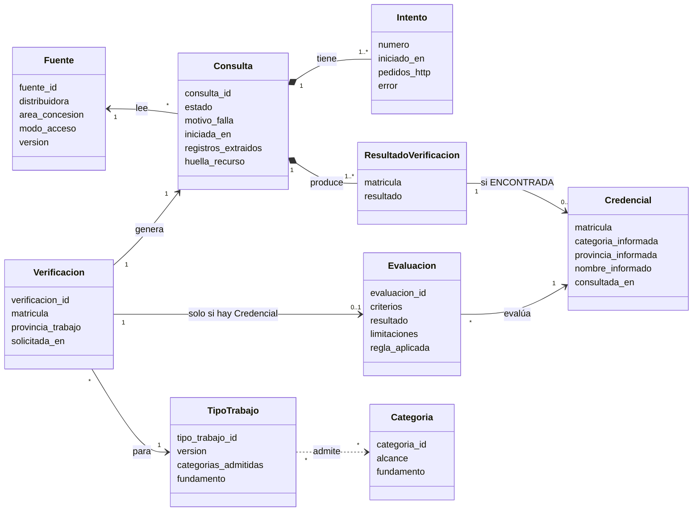
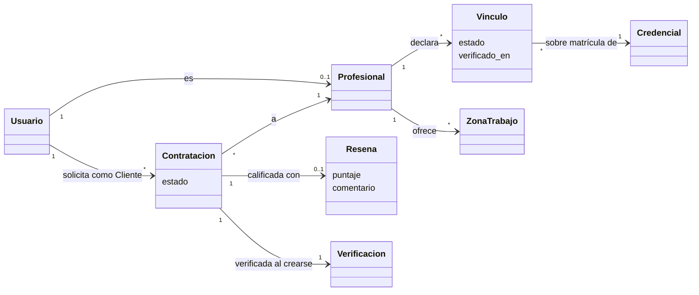
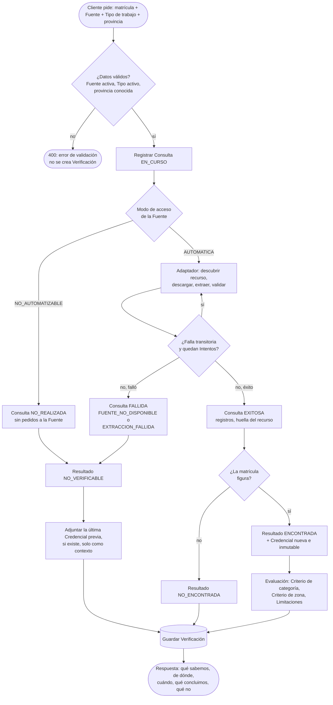
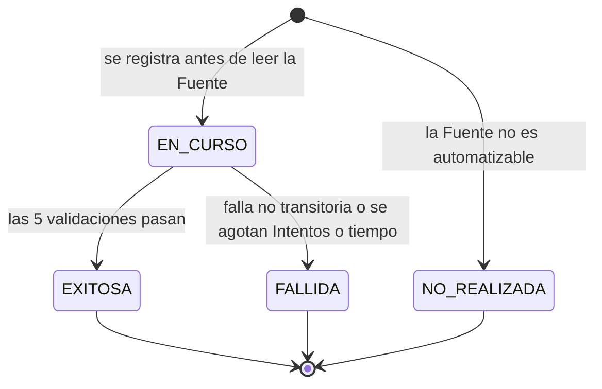
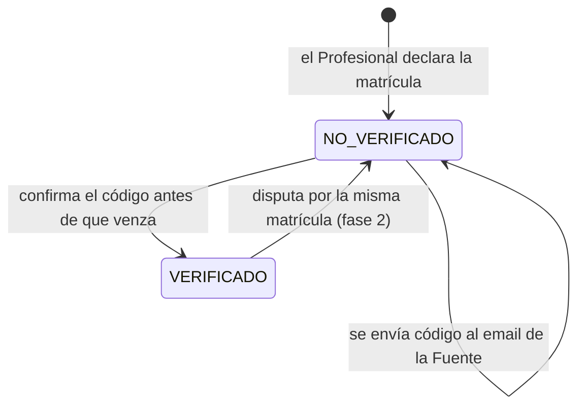
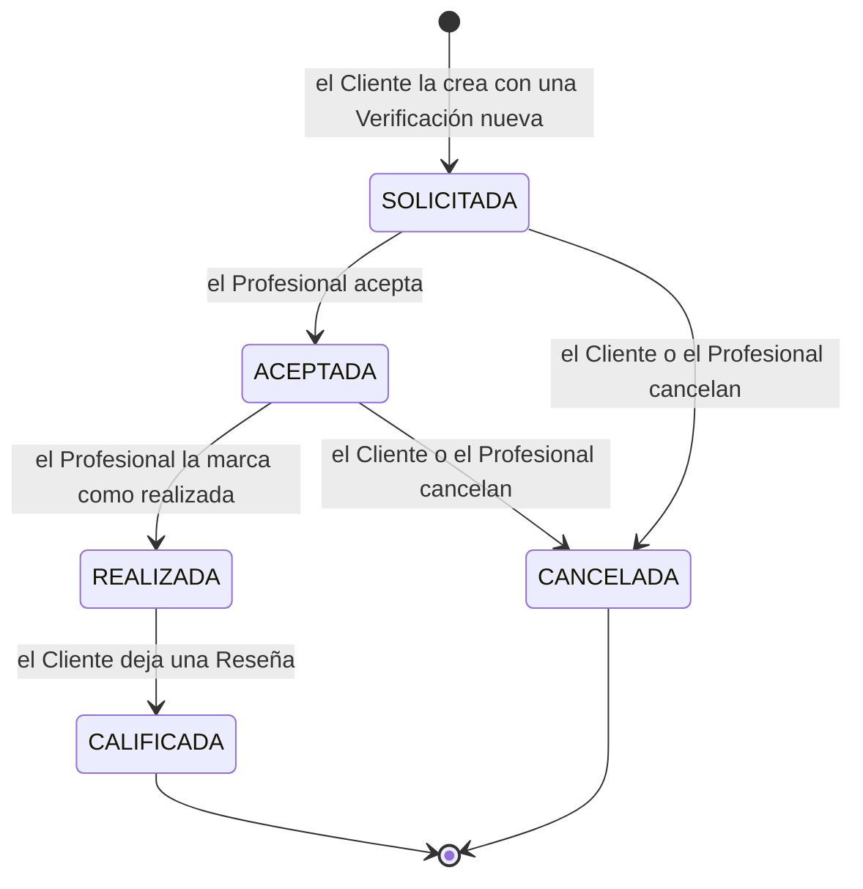

# Modelo de dominio

> Documento de diseño · Segunda entrega · Última revisión: 26/09/2026
> Responde a los puntos 1 ("modelo corregido separando Credencial y Evaluación") y 6 ("tratamiento explícito de NO_ENCONTRADO frente a NO_VERIFICABLE") de la devolución v2.
> Vocabulario canónico: [`CONTEXT.md`](../CONTEXT.md). Reglas: [`reglas-de-categoria.md`](reglas-de-categoria.md). Persistencia: [`database/README.md`](../database/README.md).

## Índice

1. [La pregunta que responde MatriculAR](#1-la-pregunta-que-responde-matricular)
2. [Credencial no es lo mismo que Evaluación](#2-credencial-no-es-lo-mismo-que-evaluación)
3. [Entidades y relaciones](#3-entidades-y-relaciones)
4. [El recorrido de una Verificación](#4-el-recorrido-de-una-verificación)
5. [NO_ENCONTRADA frente a NO_VERIFICABLE](#5-no_encontrada-frente-a-no_verificable)
6. [Cómo se calcula una Evaluación](#6-cómo-se-calcula-una-evaluación)
7. [Estados](#7-estados)
8. [Invariantes](#8-invariantes)
9. [Escenarios](#9-escenarios)
10. [Qué cambió respecto del modelo de la primera entrega](#10-qué-cambió-respecto-del-modelo-de-la-primera-entrega)

---

## 1. La pregunta que responde MatriculAR

Siguiendo la devolución del tutor, el núcleo del sistema no es "consultar padrones", sino poder responder con precisión:

> **qué sabemos, de dónde lo sabemos, cuándo lo verificamos, qué podemos concluir con esa evidencia y qué no podemos afirmar.**

Cada parte de esa frase corresponde a un elemento del modelo:

| Parte de la pregunta | Elemento del modelo |
|---|---|
| Qué sabemos | **Credencial**: matrícula, categoría, provincia y nombre informados. |
| De dónde lo sabemos | **Fuente**: el padrón de una Distribuidora. |
| Cuándo lo verificamos | **Consulta**: cuándo se leyó, con qué Intentos y qué recurso exacto se leyó. |
| Qué podemos concluir | **Evaluación**: el resultado de aplicar un Tipo de trabajo, Criterio por Criterio, con su fundamento. |
| Qué no podemos afirmar | **Limitaciones** de cada Evaluación, más los resultados `NO_VERIFICABLE` e `INDETERMINADA`. |

**Invariante rectora** (propuesta por el tutor y adoptada): *si el sistema no dispone de evidencia suficiente para afirmar algo, debe expresar la incertidumbre y no completar la respuesta por inferencia.* La ausencia de evidencia no se convierte en certeza.

---

## 2. Credencial no es lo mismo que Evaluación

|  | **Credencial** | **Evaluación** |
|---|---|---|
| Qué es | Evidencia sobre una matrícula. | Resultado de aplicar las reglas de un trabajo a esa evidencia. |
| Qué responde | "La matrícula 91 figura en el padrón de Ecogas con categoría 2ª y provincia informada Córdoba, según la Consulta del 26/09/2026 a las 15:40." | "Esa Credencial es `COMPATIBLE` con el trabajo 'Artefacto en vivienda unifamiliar' en San Luis, porque la 2ª está admitida (NAG-200 8.3.1) y San Luis está en el Área de concesión de Ecogas." |
| ¿De qué depende? | Solo de la Fuente y del momento de la Consulta. | De la Credencial, **del Tipo de trabajo** y de la provincia del trabajo. |
| ¿Tiene estado de aptitud? | **No.** No existen "credencial vencida", "credencial fuera de jurisdicción" ni "credencial con categoría insuficiente". | Sí: `COMPATIBLE`, `NO_COMPATIBLE` o `INDETERMINADA`, más un resultado por Criterio. |
| ¿Cambia? | **Nunca.** Es inmutable. Una Consulta posterior crea una Credencial nueva y la anterior queda en el historial. | Nunca se recalcula. Guarda una copia de la regla que aplicó. |
| Multiplicidad | Una por cada Consulta exitosa que encuentra la matrícula. | Una por cada Verificación que tiene Credencial. **La misma Credencial puede ser compatible con un trabajo y no con otro.** |

Ejemplo de por qué la separación importa: la Credencial "matrícula 99002, categoría 3ª" es `COMPATIBLE` con A1 (vivienda unifamiliar) y `NO_COMPATIBLE` con A2 (departamento). Si "categoría insuficiente" fuera un estado de la Credencial, habría que elegir uno de los dos, y los dos serían falsos para alguno de los trabajos.

---

## 3. Entidades y relaciones



**Módulos posteriores (P1 y P2)**, que se apoyan en el núcleo:



Descripción de cada entidad, con sus campos y tipos: [`database/README.md`](../database/README.md).

---

## 4. El recorrido de una Verificación

Este es el recorrido vertical que pidió el tutor: *adaptador → obtención/extracción → normalización de credencial → persistencia de fuente, fecha y resultado → evaluación con una regla documentada → respuesta del backend*.



Detalle técnico de cada paso: [`fuentes-y-adaptadores.md`](fuentes-y-adaptadores.md) (adaptador) y [`api.md`](api.md) (contrato y secuencias).

**Una Consulta fallida no es un error del sistema.** Es un resultado del dominio: la API responde `201 Created` con una Verificación cuyo resultado es `NO_VERIFICABLE`. Los errores HTTP quedan para los problemas del pedido del cliente (datos inválidos) o del propio sistema (base de datos caída).

---

## 5. NO_ENCONTRADA frente a NO_VERIFICABLE

|  | `NO_ENCONTRADA` | `NO_VERIFICABLE` |
|---|---|---|
| Qué pasó | La Consulta fue **exitosa** (las cinco validaciones pasaron) y la matrícula **no figura** en el recurso. | La Consulta **falló** (`FUENTE_NO_DISPONIBLE` o `EXTRACCION_FALLIDA`) o **no se realizó** (Fuente no automatizable). |
| Qué afirma el sistema | Un **resultado negativo respecto de una Fuente concreta, en una fecha concreta**. | **Incertidumbre:** hoy no sabemos nada nuevo. |
| ¿Genera Credencial? | No. | No. |
| ¿Genera Evaluación? | No. | No. |
| ¿Muestra evidencia previa? | No hace falta: la evidencia de hoy es negativa. | Sí: si existe una Credencial anterior, se muestra **con su fecha** como contexto, pero **no se usa para concluir**. |
| Mensaje al Cliente | "La matrícula 99004 **no figura** en el padrón de Ecogas según la consulta exitosa del 26/09/2026 a las 15:40. Esto no dice nada sobre otras distribuidoras." | "**No pudimos consultar** el padrón de Ecogas (26/09/2026 15:40): el formato del recurso cambió. No podemos afirmar nada con evidencia de hoy. Última evidencia disponible: figuraba con categoría 2ª según la consulta del 20/09/2026." |
| Qué nunca dice | "No está matriculado" / "no aparece en ningún padrón". | "No encontrado" / "0 matriculados". |

Para MetroGAS, el mensaje es: *"MetroGAS no permite consultas automáticas: su buscador exige un captcha. Podés verificar la matrícula manualmente en el buscador oficial: https://www.metrogas.com.ar/colaboradores/listado-de-gasistas-con-matricula/."*

---

## 6. Cómo se calcula una Evaluación

Una Evaluación se calcula **solo** cuando la Verificación tiene una Credencial nueva. El algoritmo es **fijo en el código**. Las reglas que usa (categorías admitidas, áreas de concesión, Limitaciones) son **datos versionados**.

### 6.1 Criterios

| Criterio | Entrada | `CUMPLE` | `NO_CUMPLE` | `INDETERMINADO` |
|---|---|---|---|---|
| **Categoría** | Categoría informada por la Credencial y Categorías admitidas del Tipo de trabajo | La categoría está en la lista. | Es una categoría conocida del catálogo que no está en la lista. | La categoría está vacía o no figura en el catálogo. |
| **Zona** | Provincia del trabajo y Área de concesión de la Fuente | La provincia está en el Área de concesión. | *Nunca.* | La provincia está fuera del Área de concesión, o en una provincia donde la Distribuidora opera solo en parte. |

La **Vigencia no es un Criterio** (ver [reglas § 5](reglas-de-categoria.md#5-vigencia-por-qué-no-es-un-criterio)): se informa siempre como Limitación.

### 6.2 Resultado global

```
si algún Criterio es NO_CUMPLE      → NO_COMPATIBLE
si no, si alguno es INDETERMINADO   → INDETERMINADA
si no (todos CUMPLE)                → COMPATIBLE
```

`NO_CUMPLE` tiene prioridad sobre `INDETERMINADO`. Si la categoría no alcanza, no importa que la zona sea incierta: el trabajo no es compatible.

### 6.3 Limitaciones

Cada Evaluación lleva la unión de:

1. **Las Limitaciones de la Fuente**, por ejemplo: *"La Fuente no informa la vigencia de la matrícula…"* y *"La provincia informada corresponde al domicilio del matriculado, no a la zona donde puede trabajar"*.
2. **Las Limitaciones del Tipo de trabajo**, por ejemplo, en B, la excepción de la NAG-200 8.3.1.
3. **Las Limitaciones de las condiciones asumidas:** *"Esta evaluación supone que el trabajo cumple las condiciones del tipo elegido: [lista]"*.

### 6.4 Qué se guarda

La Evaluación guarda una **copia completa** de lo que usó, para seguir siendo explicable aunque las reglas cambien:

- la referencia exacta a la Credencial (`fuente#matricula` y `consultada_en`);
- el Tipo de trabajo y su **versión**, más una copia de las categorías admitidas, las condiciones y el fundamento;
- el Área de concesión usada, copiada de la versión de la Fuente;
- el resultado y el fundamento de cada Criterio;
- las Limitaciones, como textos finales.

---

## 7. Estados

### 7.1 Consulta



- `FALLIDA` siempre lleva un **motivo**: `FUENTE_NO_DISPONIBLE` (red, tiempo agotado, HTTP 5xx, 429 o 403) o `EXTRACCION_FALLIDA` (recurso no encontrado, marcador ausente, parseo fallido, registros vacíos o inválidos, caída brusca de la cantidad de registros).
- Una Consulta que queda en `EN_CURSO` después de su plazo máximo (por ejemplo, porque la función se cortó) se lee como `FALLIDA` con motivo `FUENTE_NO_DISPONIBLE`. **El intento queda registrado igual.**
- Los estados finales no cambian nunca.

### 7.2 Resultado de verificación

No tiene transiciones: se determina una sola vez por Consulta y por matrícula.

| Estado de la Consulta | Matrícula en el recurso | Resultado de verificación |
|---|---|---|
| `EXITOSA` | Figura | `ENCONTRADA` |
| `EXITOSA` | No figura | `NO_ENCONTRADA` |
| `FALLIDA` | — | `NO_VERIFICABLE` |
| `NO_REALIZADA` | — | `NO_VERIFICABLE` |

### 7.3 Vínculo (P1)



- El email de la Fuente **se usa en el momento y no se guarda**. Si la Fuente no publica un email para esa matrícula, el Vínculo queda `NO_VERIFICADO` y se muestra así.
- Una matrícula solo puede tener **un** Vínculo `VERIFICADO` a la vez.

### 7.4 Contratación (P2)



Regla de creación (ver [módulos](modulos.md)): si la Verificación da `NO_COMPATIBLE`, la Contratación **no se crea**. Con `INDETERMINADA`, `NO_ENCONTRADA` o `NO_VERIFICABLE`, el Cliente ve una **advertencia** y decide. Con `COMPATIBLE`, se crea sin advertencias.

---

## 8. Invariantes

| # | Invariante | Por qué |
|---|---|---|
| INV-1 | Una **Credencial nunca se modifica ni se borra**. Cada Consulta exitosa que encuentra la matrícula agrega una Credencial nueva al historial de (`fuente`, `matrícula`). | Devolución v2: "sin borrar ni transformar incorrectamente la última evidencia válida disponible". |
| INV-2 | Una **Evaluación solo existe si la Verificación tiene Credencial**. | Una Evaluación aplica un Tipo de trabajo *a una Credencial*; sin Credencial no hay nada que evaluar. |
| INV-3 | `NO_ENCONTRADA` **solo** puede salir de una Consulta `EXITOSA`. Una falla **nunca** produce `NO_ENCONTRADA`. | Distinción entre un resultado negativo e incertidumbre. |
| INV-4 | Una extracción vacía, parcial o con una caída brusca de registros es `EXTRACCION_FALLIDA`, **nunca** "0 matriculados". | Devolución v2: el adaptador no debe interpretar "se encontraron cero matriculados". |
| INV-5 | El sistema **nunca afirma la Vigencia**. Se informa siempre como Limitación. | Ninguna Fuente la informa y figurar en el padrón no la prueba. |
| INV-6 | El Criterio de zona **nunca es `NO_CUMPLE`**. | Ninguna evidencia disponible permite afirmar que alguien no puede trabajar en una zona. |
| INV-7 | Las categorías **no se comparan por orden**. | Son alcances técnicos, no niveles (errata E2). |
| INV-8 | Una Evaluación **conserva una copia** de la regla que aplicó y **nunca se recalcula**. | Las normas están en revisión; una Evaluación vieja tiene que seguir siendo explicable. |
| INV-9 | Los **datos de contacto** que publica la Fuente (email, teléfono, barrio) **nunca se persisten**. | Minimización de datos personales. |
| INV-10 | Toda respuesta dice **de qué Fuente** y **de qué fecha** es la evidencia. | "De dónde lo sabemos, cuándo lo verificamos". |
| INV-11 | El sistema **nunca generaliza** a "ningún padrón": los resultados se informan por Fuente. | Devolución v2. |
| INV-12 | En los datos del producto **no hay Fuentes simuladas**. Los datos ficticios se usan solo en la documentación y en los tests. | Distinguir lo que el sistema puede conocer de lo que solo puede simular. |

---

## 9. Escenarios

Todos los datos de estos escenarios son **ficticios** (matrículas de la serie 99001–99005, nombres inventados). Reemplazan a la matriz de casos de la investigación, que tenía los errores E1, E2, E5 y E7.

| # | Pedido | Resultado de la Consulta | Resultado de verificación | Evaluación | Qué muestra el sistema |
|---|---|---|---|---|---|
| S1 | Ecogas, matrícula 99001, **A1**, Córdoba | `EXITOSA` | `ENCONTRADA` (2ª, Córdoba) | **`COMPATIBLE`**: categoría `CUMPLE` (2ª admitida, 8.3.1) · zona `CUMPLE` (Córdoba ∈ área) | Compatible, con la fecha de la Consulta y las Limitaciones (vigencia y condiciones asumidas). |
| S2 | La misma matrícula 99001, pero tipo **B** | `EXITOSA` | `ENCONTRADA` (2ª) | **`NO_COMPATIBLE`**: categoría `NO_CUMPLE` (B solo admite 1ª, 8.3.1) | No compatible, con la cita y la Limitación de la excepción 8.3.1. **La misma evidencia (categoría 2ª) da otro resultado con otro trabajo.** |
| S3 | Ecogas, matrícula 99002 (**1ª**), **A2**, Mendoza | `EXITOSA` | `ENCONTRADA` (1ª) | **`COMPATIBLE`** | Corrige el caso "categoría insuficiente" de la investigación (E2): la 1ª puede hacer este trabajo. |
| S4 | Ecogas, matrícula 99001 (provincia informada **Córdoba**), A1, **San Luis** | `EXITOSA` | `ENCONTRADA` | **`COMPATIBLE`**: zona `CUMPLE` (San Luis ∈ área de Ecogas) | Corrige el caso "jurisdicción incorrecta" (E1): la provincia informada no se usa para evaluar. |
| S5 | Ecogas, matrícula 99003 (3ª), A1, **Buenos Aires** | `EXITOSA` | `ENCONTRADA` | **`INDETERMINADA`**: categoría `CUMPLE` · zona `INDETERMINADO` | "El trabajo es en Buenos Aires, fuera del área de Ecogas: no sabemos si está registrado en la distribuidora de esa zona." |
| S6 | Ecogas, matrícula 99004, A1, Córdoba | `EXITOSA` (5.031 registros) | **`NO_ENCONTRADA`** | — | "No figura en el padrón de Ecogas según la consulta exitosa del [fecha]." |
| S7 | Ecogas, matrícula 99001, A1, Córdoba, **con el recurso cambiado** | `FALLIDA` · `EXTRACCION_FALLIDA` (1 Intento, sin reintento) | **`NO_VERIFICABLE`** | — | "No pudimos consultar Ecogas." Se muestra la Credencial del 20/09 como contexto, sin concluir nada. |
| S8 | Ecogas, **sin conexión** durante los 3 Intentos | `FALLIDA` · `FUENTE_NO_DISPONIBLE` (3 Intentos registrados) | **`NO_VERIFICABLE`** | — | Igual que S7, con motivo "la fuente no respondió". |
| S9 | **MetroGAS**, matrícula 99005, A1, CABA | `NO_REALIZADA` (0 Intentos) | **`NO_VERIFICABLE`** | — | Link al buscador oficial de MetroGAS. |
| S10 | Ecogas, matrícula 99001, **A1**, San Juan, con categoría informada **vacía** | `EXITOSA` | `ENCONTRADA` (categoría "") | **`INDETERMINADA`**: categoría `INDETERMINADO` | "La Fuente no informa una categoría reconocible para esta matrícula." |

Los ejemplos concretos de estos ítems, en el formato en que se guardan, están en [`database/seed/ejemplos-ficticios/`](../database/seed/ejemplos-ficticios/).

---

## 10. Qué cambió respecto del modelo de la primera entrega

| Primera entrega (README original) | Modelo actual | Motivo |
|---|---|---|
| Máquina de estados del **Profesional**: `pendiente_verificación → verificado / rechazado`, `verificado → vencido → verificado` | El Profesional **no tiene estado de habilitación**. La evidencia vive en las Credenciales (inmutables, con historial) y la conclusión en las Evaluaciones (una por trabajo). | Credencial ≠ Evaluación (devolución v2). |
| Estado `vencido` y degradación automática por vencimiento | **Eliminado.** La Vigencia es una Limitación. | Ninguna Fuente informa vencimientos; no se modelan fechas ficticias. |
| "Verificado" como sello de confianza | Resultado de verificación **por Fuente y por fecha**, más una Evaluación **por Tipo de trabajo**. | Una misma matrícula puede ser adecuada para un trabajo y no para otro. |
| Estados de credencial de la investigación (`fuera_de_jurisdiccion`, `categoria_insuficiente`, `no_encontrado`, `no_verificable`) | Criterios de la Evaluación (categoría, zona) y Resultados de verificación (`ENCONTRADA`, `NO_ENCONTRADA`, `NO_VERIFICABLE`). | La misma separación. |
| Jurisdicción = provincia del padrón | Se separa en **Provincia informada**, **Área de concesión** y **provincia del trabajo**. | Errata E1. |
| Carga de un documento de credencial a S3 | **Eliminada.** La evidencia es la Fuente, y la titularidad se prueba con el Vínculo (código al email de la Fuente). | Una foto del carné no prueba nada que el sistema pueda chequear. |
| Contratación: solicitada → aceptada → realizada → calificada (con cancelación) | **Se mantiene**, y además cada Contratación queda asociada a una Verificación. | — |
