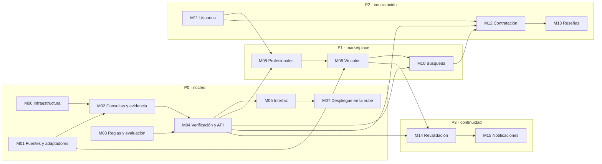
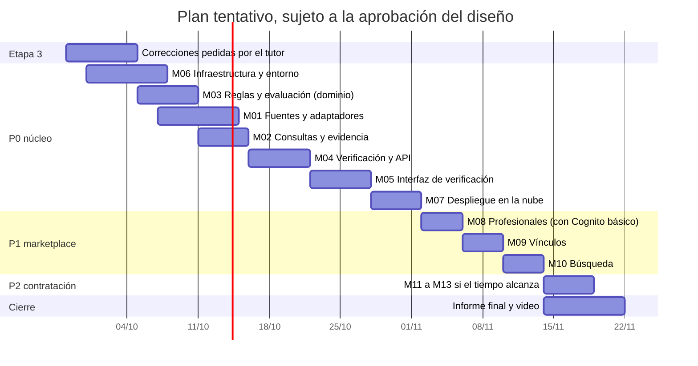

# Módulos

> Documento de diseño · Segunda entrega · Última revisión: 26/09/2026
> Cumple el ítem "Listado de Módulos" de la consigna: todos los módulos funcionales que se van a desarrollar, con una descripción breve de cada uno y su prioridad.
> Relacionados: [arquitectura](arquitectura.md) · [API](api.md) · [base de datos](../database/README.md) · [glosario](../CONTEXT.md)

## Índice

1. [Prioridades](#1-prioridades)
2. [Listado de módulos](#2-listado-de-módulos)
3. [Dependencias entre módulos](#3-dependencias-entre-módulos)
4. [Detalle de cada módulo](#4-detalle-de-cada-módulo)
5. [Fuera de alcance](#5-fuera-de-alcance)
6. [Plan tentativo](#6-plan-tentativo)

---

## 1. Prioridades

| Prioridad | Significado | Compromiso |
|---|---|---|
| **P0** | **Núcleo de verificación.** Es el recorrido vertical que pidió el tutor, y el diferencial de MatriculAR. | **Se entrega completo.** Nada de P1 empieza hasta que el P0 funcione de punta a punta, local y en la nube. |
| **P1** | Profesionales y búsqueda: el marketplace se apoya sobre el núcleo. | Se entrega si el P0 está cerrado. |
| **P2** | Cuentas, contratación y reseñas: el ciclo completo de contratación. | Se entrega si el tiempo alcanza. Es lo primero que se recorta después de P3. |
| **P3** | Revalidación programada y notificaciones. | Solo si sobra tiempo; si no, queda documentado para la fase 2. |

Regla de recorte: si el plan se atrasa, **se recorta de abajo hacia arriba** (primero P3, después P2 y después P1), nunca el P0. Esto sigue el principio de la primera entrega: *pocas cosas completas en lugar de muchas a medias*.

---

## 2. Listado de módulos

| ID | Módulo | Prioridad | Descripción breve | Función / carpeta |
|---|---|---|---|---|
| **M01** | Fuentes y adaptadores | **P0** | Lee el padrón de cada Distribuidora mediante un adaptador: Ecogas (automatizable) y MetroGAS (no automatizable). Descubre el recurso, aplica las cinco validaciones, clasifica las fallas y descarta los datos de contacto. | `λ verificacion` · [`backend/verificacion/`](../backend/verificacion/) |
| **M02** | Consultas y evidencia | **P0** | Registra cada Consulta con sus Intentos, sus Resultados de verificación y la huella del recurso. Crea Credenciales inmutables con historial. | `λ verificacion` |
| **M03** | Reglas y evaluación | **P0** | Mantiene el catálogo de Categorías y los Tipos de trabajo versionados. Calcula la Evaluación (Criterios de categoría y zona, resultado global y Limitaciones). | `λ verificacion` · [`backend/compartido/`](../backend/compartido/) |
| **M04** | Verificación y API | **P0** | Caso de uso *Verificar* de punta a punta y los endpoints públicos del P0 (verificación, historial, salud de la Fuente y catálogos). | `λ verificacion` |
| **M05** | Interfaz de verificación | **P0** | Pantalla web: formulario y resultado con evidencia, Criterios, Limitaciones e historial. | [`frontend/`](../frontend/) |
| **M06** | Infraestructura y entorno | **P0** | Terraform para todos los recursos, entorno LocalStack reproducible, carga de datos semilla y scripts de desarrollo. | [`infra/`](../infra/) · [`database/`](../database/) |
| **M07** | Despliegue en la nube y observabilidad | **P0** (requisito de la etapa 4) | El mismo Terraform aplicado en AWS real, el frontend servido desde S3, alerta de presupuesto, logs y alarmas. | [`infra/`](../infra/) |
| **M08** | Profesionales | **P1** | Perfil del gasista: nombre visible, presentación y tipos de trabajo ofrecidos. | `λ profesionales` · [`backend/profesionales/`](../backend/profesionales/) |
| **M09** | Vínculos | **P1** | Relación Profesional–Matrícula, verificada con un código que se envía al email que publica la propia Fuente. | `λ profesionales` |
| **M10** | Búsqueda | **P1** | Zonas de trabajo y búsqueda de Profesionales por tipo de trabajo y provincia, con una Verificación del momento. | `λ profesionales` |
| **M11** | Usuarios y autenticación | **P2** | Cuentas de Cliente y Profesional con Cognito. Autorización en API Gateway. | Cognito · `λ contrataciones` |
| **M12** | Contratación | **P2** | Solicitud → aceptada → realizada → calificada, o cancelada. Cada Contratación queda asociada a una Verificación hecha al crearla. | `λ contrataciones` · [`backend/contrataciones/`](../backend/contrataciones/) |
| **M13** | Reseñas y reputación | **P2** | Puntaje y comentario sobre Contrataciones realizadas, más el promedio del Profesional. | `λ contrataciones` |
| **M14** | Revalidación programada | **P3** | Todos los días, una Consulta por Fuente para todas las matrículas vinculadas. Caso de uso *Revalidar*, armado con los mismos componentes del núcleo que *Verificar*. | `λ revalidacion` · [`backend/revalidacion/`](../backend/revalidacion/) |
| **M15** | Notificaciones | **P3** | Avisos cuando una revalidación cambia el Resultado de verificación de un Profesional (por ejemplo, de `FOUND` a `NOT_FOUND`). | `λ notificaciones` · [`backend/notificaciones/`](../backend/notificaciones/) |

---

## 3. Dependencias entre módulos

> **M11 (Usuarios)** tiene prioridad P2 como módulo completo, pero la **autenticación básica con Cognito** se adelanta en P1, porque el Profesional necesita una cuenta para gestionar su perfil. En P2 se suma el rol de Cliente y la autorización de la contratación.

---

## 4. Detalle de cada módulo

Para cada módulo: qué hace, con qué datos trabaja, qué expone y cómo se demuestra que está terminado.

### M01 · Fuentes y adaptadores · P0

| | |
|---|---|
| **Responsabilidades** | Implementar el puerto de Fuentes. **Adaptador de Ecogas:** descubrir el recurso desde el HTML, descargarlo, decodificarlo, aplicar las validaciones V1 a V5, normalizar y descartar el contacto. **Adaptador no automatizable** (MetroGAS): responder "no realizada" sin hacer pedidos. Clasificar las fallas y aplicar la política de Intentos. |
| **Datos** | Lee `Fuentes` (configuración versionada) y la última Consulta exitosa (para V5). No escribe. |
| **Expone** | `PuertoFuente.leer` (P0) y `PuertoFuente.obtenerContactoParaVinculo` (P1). |
| **Diseño** | [`fuentes-y-adaptadores.md`](fuentes-y-adaptadores.md) |
| **Terminado cuando** | Pasan las 14 fixtures (F1 a F14). Ninguna salida contiene email, teléfono ni barrio. Una prueba de humo manual lee el padrón real de Ecogas. |

### M02 · Consultas y evidencia · P0

| | |
|---|---|
| **Responsabilidades** | Registrar la Consulta `IN_PROGRESS` antes del primer pedido. Finalizarla con estado, motivo, detalle, Intentos, huella y resumen. Crear un Resultado de verificación por matrícula y una Credencial inmutable si es `FOUND`. Interpretar como interrumpida una Consulta que sigue `IN_PROGRESS` después de su plazo. |
| **Datos** | `Consultas`, `ResultadosVerificacion` y `Credenciales`. |
| **Invariantes** | INV-1, INV-3, INV-4, INV-9 y INV-10 ([modelo § 8](modelo-de-dominio.md#8-invariantes)). |
| **Terminado cuando** | Las escrituras condicionales impiden modificar una Credencial (probado contra DynamoDB en LocalStack). Una falla no toca la evidencia anterior. El historial de una matrícula se lee en orden. |

### M03 · Reglas y evaluación · P0

| | |
|---|---|
| **Responsabilidades** | Cargar y servir las versiones vigentes de Categorías y Tipos de trabajo. Calcular los Criterios de categoría (por lista explícita, sin orden) y de zona (por Área de concesión, nunca `NOT_MET`), el resultado global y las Limitaciones. Guardar la Evaluación con una copia de la regla aplicada. |
| **Datos** | `Categorias`, `TiposTrabajo` y `Evaluaciones`. |
| **Diseño** | [`reglas-de-categoria.md`](reglas-de-categoria.md) · [modelo § 6](modelo-de-dominio.md#6-cómo-se-calcula-una-evaluación) |
| **Terminado cuando** | Los escenarios S1 a S10 pasan como pruebas unitarias del dominio (sin AWS). Cada Tipo de trabajo tiene su cita normativa. |

### M04 · Verificación y API · P0

| | |
|---|---|
| **Responsabilidades** | Caso de uso *Verificar*: validar el pedido, orquestar M01, M02 y M03 y persistir todo en una transacción. Armar el mensaje: qué sabemos, de dónde, cuándo, qué concluimos y qué no. Endpoints de consulta: Verificación, historial, salud de la Fuente y catálogos. |
| **Datos** | `Verificaciones`, más todas las tablas del núcleo. |
| **Expone** | [`api.md`](api.md) § 2 a 5. |
| **Terminado cuando** | Los escenarios S1, S5, S6, S7 y S9 se recorren **de punta a punta** por HTTP contra LocalStack, con las respuestas del contrato. Una Fuente que falla responde `201 UNVERIFIABLE`, nunca un `5xx`. |

### M05 · Interfaz de verificación · P0

| | |
|---|---|
| **Responsabilidades** | Formulario (Fuente, matrícula, Tipo de trabajo con sus condiciones, provincia). Vista del resultado: resultado global, evidencia con fecha y Fuente, Criterios con su fundamento, Limitaciones, detalle técnico plegable (Consulta, Intentos, huella) e historial de la matrícula. Enlace para compartir una Verificación. |
| **Diseño** | [`frontend/README.md`](../frontend/README.md) |
| **Terminado cuando** | Los cuatro resultados posibles (`COMPATIBLE`, `INCOMPATIBLE`, `INDETERMINATE`, sin Evaluación) y los dos tipos de `UNVERIFIABLE` se ven distintos y se entienden sin leer la documentación. |

### M06 · Infraestructura y entorno · P0

| | |
|---|---|
| **Responsabilidades** | Terraform para las 8 tablas del núcleo (más las de P1 y P2 cuando se implementen), la función, API Gateway con límites de uso, IAM de mínimo privilegio (sin `DeleteItem` sobre la evidencia y sin `UpdateItem` salvo para finalizar la Consulta) y logs. Script de carga de datos semilla. Levantar y destruir el entorno con un comando. |
| **Diseño** | [`infra/README.md`](../infra/README.md) · [`database/`](../database/) |
| **Terminado cuando** | `lstk terraform apply` más el seed dejan el sistema funcionando desde cero, y `destroy` lo elimina sin residuos. |

### M07 · Despliegue en la nube y observabilidad · P0 (etapa 4)

| | |
|---|---|
| **Responsabilidades** | Aplicar el mismo Terraform en AWS real (Free plan). Servir el frontend desde S3. Alerta de presupuesto de USD 5. Logs estructurados y alarma por proporción de Consultas fallidas. Probar temprano si Ecogas acepta pedidos desde IPs de AWS. |
| **Terminado cuando** | El servicio responde en una URL pública y el recorrido completo funciona en la nube. |

### M08 · Profesionales · P1

| | |
|---|---|
| **Responsabilidades** | Crear y editar el perfil del Profesional autenticado: nombre visible, presentación, tipos de trabajo ofrecidos y estado (activo o pausado). |
| **Datos** | `Profesionales`. |
| **Terminado cuando** | Un gasista con cuenta crea su perfil y lo ve publicado. |

### M09 · Vínculos · P1

| | |
|---|---|
| **Responsabilidades** | Declarar una matrícula (queda `UNVERIFIED`). Enviar un código al email que publica la Fuente (se usa en memoria y no se guarda). Confirmar el código (pasa a `VERIFIED`). Garantizar un solo Vínculo verificado por matrícula, con una escritura condicional en `TitularesMatricula` dentro de la misma transacción. Mostrar como "no verificado" al que no tiene email en la Fuente. |
| **Datos** | `Vinculos` (el código solo como hash) y `TitularesMatricula`. |
| **Riesgo** | SES en modo *sandbox* ([arquitectura § 12](arquitectura.md#12-riesgos)). |
| **Terminado cuando** | Un Profesional verifica su matrícula con el código. Un segundo usuario no puede verificar la misma matrícula. |

### M10 · Búsqueda · P1

| | |
|---|---|
| **Responsabilidades** | Declarar zonas de trabajo. Buscar Profesionales por tipo de trabajo y provincia: una Consulta **por Fuente** para todos los candidatos (Consulta 1 → N), Evaluación de cada uno y listado con su resultado y la fecha de la evidencia. Por defecto solo se muestran Vínculos verificados. |
| **Datos** | `ZonasTrabajo`, más el núcleo. |
| **Terminado cuando** | La búsqueda muestra evidencia de ese momento y distingue claramente los resultados `COMPATIBLE`, `INDETERMINATE` y `UNVERIFIABLE`. |

### M11 · Usuarios y autenticación · P2

| | |
|---|---|
| **Responsabilidades** | Registro e inicio de sesión con Cognito. Roles de Cliente y Profesional. Autorizador de API Gateway. Perfil mínimo de la cuenta. |
| **Datos** | `Usuarios` (sin contraseñas). |
| **Terminado cuando** | Las rutas de P1 y P2 rechazan pedidos sin un token válido. |

### M12 · Contratación · P2

| | |
|---|---|
| **Responsabilidades** | Crear la Contratación con una Verificación nueva. `INCOMPATIBLE` la bloquea. `INDETERMINATE`, `NOT_FOUND` y `UNVERIFIABLE` exigen que el Cliente confirme la advertencia. Transiciones condicionales según la máquina de estados. Historial de transiciones. |
| **Datos** | `Contrataciones`. |
| **Diseño** | [modelo § 7.4](modelo-de-dominio.md#74-contratación-p2) |
| **Terminado cuando** | El ciclo completo funciona y una transición inválida se rechaza. |

### M13 · Reseñas y reputación · P2

| | |
|---|---|
| **Responsabilidades** | Una Reseña por Contratación realizada (puntaje de 1 a 5 y comentario). Actualizar el promedio del Profesional. Listar las Reseñas públicas. |
| **Datos** | `Resenas` y `Profesionales` (promedio). |
| **Terminado cuando** | Calificar pasa la Contratación a `RATED` y actualiza la reputación. |

### M14 · Revalidación programada · P3

| | |
|---|---|
| **Responsabilidades** | Todos los días, EventBridge Scheduler invoca una Consulta por Fuente con todas las matrículas vinculadas y registra los Resultados. El caso de uso *Revalidar* usa los mismos componentes del núcleo que *Verificar* (lectura de la Fuente, registro de la Consulta y de los Resultados), con otro disparador (el espíritu de la D3). |
| **Terminado cuando** | Una revalidación con 100 matrículas hace **una** descarga por Fuente. |

### M15 · Notificaciones · P3

| | |
|---|---|
| **Responsabilidades** | Detectar cambios de Resultado de verificación entre revalidaciones y avisar al Profesional y a los Clientes con Contrataciones activas, vía SNS. |
| **Terminado cuando** | Un cambio simulado en los tests genera el aviso. |

---

## 5. Fuera de alcance

Documentado para la **fase 2**, fuera del proyecto final:

| Excluido | Por qué |
|---|---|
| **Electricistas** (COPIME, ERSeP, APSE) | Toda la evidencia investigada es de gas. Otro oficio implica otra investigación de Fuentes y de reglas. |
| **Otras distribuidoras de gas** (Naturgy BAN, Camuzzi, Litoral Gas, …) | Cada una requiere investigación y, si es automatizable, un adaptador. La arquitectura ya lo permite (M01). |
| Pagos y facturación | No hacen al problema central. |
| Chat en tiempo real | Idem. |
| Geolocalización fina (la zona se modela por provincia) | La precisión de la zona está limitada por las Fuentes, que informan provincia y localidad. |
| Panel de administración (back-office) | Las reglas y Fuentes se administran con archivos versionados y revisión por PR. |
| Apps móviles nativas | El frontend web es responsive. |
| Resolución de disputas por un mismo Vínculo | Requiere un proceso manual. |
| Consultar MetroGAS automáticamente | Protegido con captcha. No corresponde evitarlo. |

---

## 6. Plan tentativo

Fechas **estimadas**. El inicio depende de la aprobación de esta entrega, y la etapa 4 de la hoja de ruta va del 28/09 al 21/11.

| Hito | Fecha estimada | Qué se demuestra |
|---|---|---|
| Diseño aprobado | primera semana de octubre | Esta entrega, con las correcciones del tutor. |
| **P0 local** | ~28/10 | El recorrido vertical completo contra LocalStack, incluido el camino de error. |
| **P0 en la nube** | ~02/11 | El mismo recorrido en AWS real, con una URL pública. |
| P1 | ~14/11 | Profesionales con Vínculo verificado y búsqueda. |
| Entrega final | 21/11 | Repositorio, servicio en la nube, informe y video. |

**Cómo se trabaja** (después de la aprobación): el diseño aprobado se convierte en una especificación y en tickets verticales que cruzan todas las capas. El primero es el recorrido del P0: *adaptador Ecogas → Consulta → Credencial → Evaluación → `POST /verificaciones`*. Se desarrolla con TDD y cada ticket se revisa por PR entre los dos integrantes.
